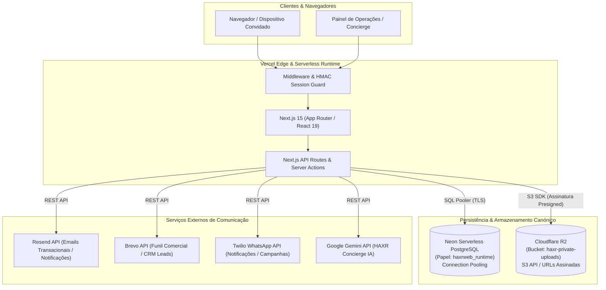

# HAXR Signature

**Plataforma de alta costura digital e infraestrutura operacional de planeamento de eventos.**

A HAXR Signature une a assessoria e produção executiva de casamentos e eventos de alto padrão em Moçambique a uma arquitetura tecnológica proprietária. O ecossistema suporta todo o ciclo operacional, desde o primeiro contacto editorial e qualificação comercial, passando pela gestão de convidados, check-in em tempo real e conciliação financeira, até ao arquivo documental seguro e integração com convites digitais de alta-costura.

| Canal | Destino Canónico |
| :--- | :--- |
| **Website Oficial** | [https://www.haxrsignature.com](https://www.haxrsignature.com) |
| **Motor de Convites (Edition)** | [https://edition.haxrsignature.com](https://edition.haxrsignature.com) |
| **Repositório GitHub** | [MrDimande/haxrsignatureweb](https://github.com/MrDimande/haxrsignatureweb) |

---

## 1. Visão Geral do Produto

A HAXR Signature opera como um atelier privado de planeamento onde a tecnologia é o sistema operativo invisível por trás de uma experiência física e humana impecável.

O sistema integra três camadas interdependentes:

1. **Frente Editorial Pública:** Apresentação da casa de eventos, portfólio, serviços de assessoria, guias de planeamento e ferramentas digitais para casais e profissionais.
2. **Painel Operacional Administrativo:** Gestão de clientes, eventos com timeline e orçamento, credenciação e revisão de listas de convidados, controlo de pagamentos e proformas com emissão de PDF e triagem automatizada de pedidos via *HAXR Concierge*.
3. **Portal do Cliente (Self-Service Seguro):** Área exclusiva do casal acedida por chave digital (token seguro sem atrito de password convencional), com aprovações em tempo real, consulta de orçamentos e upload de comprovativos.

---

## 2. Arquitetura de Produção

A infraestrutura canónica opera inteiramente desacoplada de serviços BaaS monolíticos, ancorada em serviços de padrão internacional de alta performance e disponibilidade:



---

## 3. Domínios Centrais da Aplicação

- **Eventos & Cronogramas:** Gestão integral do ciclo de vida de casamentos e celebrações privadas (datas, fases cerimoniais, locais em Moçambique e parâmetros estéticos).
- **Clientes & CRM:** Registo central de clientes com histórico de reuniões, propostas contratuais e preferências de atendimento.
- **Gestão de Convidados (RSVP & Seating):** Gestão de mesas, acompanhantes, dietary requirements, códigos de confirmação e distribuição no salão.
- **Check-in em Tempo Real:** Validação de entradas no dia do evento via `/event/[eventId]/checkin/[token]` e módulo de busca rápida *Find Your Seat*.
- **Fornecedores & Parceiros:** Diretório curado de profissionais de eventos em Moçambique com classificação por categorias e pipeline de aprovação comercial.
- **Financeiro & Pagamentos:** Controlo orçamental, emissão de proformas e recibos em PDF (`@react-pdf/renderer`), com verificação de comprovativos de transferência.
- **HAXR Concierge:** Assistente de triagem assistida por IA que classifica pedidos não estruturados de noivos, sugere alocações orçamentais e rotas operacionais.
- **Documentos Privados:** Gestão e arquivo de propostas comerciais e contratos com armazenamento encriptado e leitura por URL assinada de curta duração.
- **Integração com Edition Engine:** Coordenação de RSVPs públicos e sincronização de dados entre a plataforma web e o motor de convites digitais.

---

## 4. Arquitetura da Base de Dados (Neon PostgreSQL)

A camada de persistência canónica assenta em **Neon Serverless PostgreSQL** com isolamento estrito de privilégios:

- **Papéis de Runtime e Menor Privilégio:** As conexões de aplicação utilizam o utilizador `haxrweb_runtime`, com privilégios limitados às tabelas do esquema operacional, sem autorização para execução de comandos DDL ou bypass administrativo.
- **Connection Pooling:** Utilização nativa do pooler pgBouncer do Neon (`DATABASE_URL`) com limite rigoroso de pool (`max: 5`) para eliminar contenção em ambientes serverless Next.js, mantendo a URL direta (`DATABASE_URL_UNPOOLED`) exclusivamente para migrações e operações estruturais.
- **Disciplina de Transações:** Operações críticas de mutação (como atualizações de inventário, conciliação e criação de lotes) utilizam o utilitário `withNeonTransaction` garantindo atomicidade estrita (`BEGIN ... COMMIT / ROLLBACK`).

---

## 5. Arquitetura de Armazenamento (Cloudflare R2)

O armazenamento privado de ficheiros é gerido pelo **Cloudflare R2**:

- **Modelo de Bucket Privado:** O bucket `haxr-private-uploads` é 100% privado, sem qualquer exposição de leitura pública anónima.
- **Estratégia de URLs Assinadas:** Qualquer download ou visualização de ficheiros (ex: PDFs de propostas, comprovativos de transferência) é feito através de presigned URLs geradas com o `@aws-sdk/s3-request-presigner` com validade curta (default: 600 segundos).
- **Estrutura de Chaves Canónicas:**

  ```text
  events/{eventId}/concierge/{itemId}/{filename}
  clients/{clientId}/documents/{documentId}/{filename}
  ```

- **Proteção de Path Traversal:** Função nativa `assertSafeStoragePath` que bloqueia sequências `..`, barras iniciais erróneas ou carateres nulos antes de qualquer chamada à API S3.

---

## 6. Autenticação & Segurança

- **Sessão Administrativa Baseada em HMAC:** O acesso ao `/admin` é protegido por cookies `httpOnly`, `SameSite=Lax`, assinados criptograficamente com HMAC-SHA256 (`ADMIN_SESSION_SECRET`). O painel não depende de serviços externos de auth para o controlo administrativo direto.
- **Acesso ao Portal do Cliente:** Links mágicos encriptados com tokens de uso único e prazo de expiração para noivos e clientes, garantindo acesso direto aos seus eventos sem passwords partilhadas.
- **Isolamento de Segredos de Servidor:** Credenciais sensíveis (chaves secretas R2, segredos Brevo/Resend, credenciais de base de dados) operam exclusivamente no servidor e nunca são prefixadas com `NEXT_PUBLIC_`.

---

## 7. Desenvolvimento Local

### Pré-requisitos

- Node.js 20+ (recomendado Node.js 22 LTS ou 24)
- npm 10+
- Acesso de rede à instância de desenvolvimento Neon e bucket de testes Cloudflare R2

### Instalação

```bash
git clone https://github.com/MrDimande/haxrsignatureweb.git
cd haxrsignatureweb
npm install
```

### Comandos de Execução

```bash
# Iniciar servidor local de desenvolvimento
npm run dev

# Executar verificação de tipos TypeScript
npx tsc --noEmit

# Executar linter ESLint
npm run lint

# Executar build de produção para validação
npm run build
```

---

## 8. Variáveis de Ambiente

As variáveis devem ser configuradas no ficheiro `.env.local` (ignorado pelo Git). **Nunca versione ficheiros de ambiente.**

| Variável | Obrigatória | Âmbito | Finalidade |
| :--- | :---: | :--- | :--- |
| `DATABASE_URL` | **Sim** | Server | Connection string do Neon com pooler (`sslmode=require`) |
| `DATABASE_URL_UNPOOLED` | Não | Server | Connection string direta do Neon para migrações e scripts DDL |
| `HAXR_DATABASE_PROVIDER` | **Sim** | Server | Define o provedor de dados canónico (`neon`) |
| `HAXR_PRIVATE_STORAGE_PROVIDER` | **Sim** | Server | Define o provedor de storage privado (`r2-s3`) |
| `CLOUDFLARE_R2_PRIVATE_ACCOUNT_ID` | **Sim** | Server | ID de conta Cloudflare |
| `CLOUDFLARE_R2_PRIVATE_ACCESS_KEY_ID` | **Sim** | Server | Chave de acesso S3 para o bucket privado R2 |
| `CLOUDFLARE_R2_PRIVATE_SECRET_ACCESS_KEY` | **Sim** | Server | Segredo de acesso S3 para o bucket privado R2 |
| `CLOUDFLARE_R2_PRIVATE_ENDPOINT` | **Sim** | Server | Endpoint S3 HTTPS do Cloudflare R2 |
| `CLOUDFLARE_R2_PRIVATE_BUCKET` | **Sim** | Server | Nome do bucket R2 privado (`haxr-private-uploads`) |
| `ADMIN_EMAIL` | **Sim** | Server | Email do utilizador de operações e administração |
| `ADMIN_PASSWORD` | **Sim** | Server | Palavra-passe administrativa |
| `ADMIN_SESSION_SECRET` | **Sim** | Server | Chave de assinatura criptográfica de sessões de cookies |
| `RESEND_API_KEY` | **Sim** | Server | Chave da API Resend para notificações e auto-respostas |
| `BREVO_API_KEY` | Opcional | Server | Chave de integração comercial do Brevo (CRM / funil) |
| `GEMINI_API_KEY` | Opcional | Server | Chave Google Gemini AI para o motor HAXR Concierge |
| `NEXT_PUBLIC_SITE_URL` | **Sim** | Public | URL canónico público (`https://www.haxrsignature.com`) |

---

## 9. Testes e Validação Operacional

O repositório inclui utilitários de auditoria e validação canónica em `scripts/`:

```bash
# Validação da saúde canónica de produção (rotas, admin, check-in, leitura R2)
node scripts/test-canonical-health.cjs

# Validação estrita de credenciais e permissões R2
node scripts/validate-private-r2-credential.cjs

# Auditoria de leitura e verificação de integridade SHA-256 em R2
node scripts/validate-production-read.cjs

# Inventário e auditoria de ficheiros R2
node scripts/verify-r2-read-only-inventory.mjs
```

---

## 10. Deployment

O deployment em produção é executado de forma contínua através da **Vercel** acoplada ao branch `main` do repositório:

- Cada pull request gera um ambiente de Preview isolado.
- Commits no branch `main` desencadeiam a validação de tipos, build e deploy atómico em produção.
- O domínio público oficial e canónico é `https://www.haxrsignature.com`.

---

## 11. Recuperação de Desastres & Política de Backup

- **Base de Dados (Neon):** Recuperação pontual no tempo (*Point-in-Time Restore*) e branching instantâneo nativo do Neon para salvaguarda de dados sem impacto de downtime.
- **Armazenamento (Cloudflare R2):** Ficheiros preservados com redundância distribuída em múltiplos data centers Cloudflare.
- **Disciplina de Resposta a Incidentes (*Repair-Forward*):** Em caso de falha ou anomalia operacional, a abordagem obrigatória é a correção progressiva para a frente (*repair-forward*). É estritamente proibido efetuar restauro cego a partir do snapshot legado da Supabase, uma vez que este representa um arquivo frio pré-migração.

---

## 12. Histórico de Migração

A migração de saída da infraestrutura Supabase para Neon PostgreSQL e Cloudflare R2 foi formalmente concluída e selada em **2026-09-06** (Tag: `supabase-exit-2026-09-06`).

Para consultar a cronologia completa dos Gates técnicos (Gates 3A a 3H), inventários de transferência e relatórios de segurança, consulte:
👉 [**docs/migrations/README.md**](./docs/migrations/README.md)

---

## 13. Estrutura do Repositório

```text
haxrsignatureweb/
├── docs/
│   ├── migrations/          # Relatórios técnicos e manifests da migração
│   └── audits/              # Auditorias de arquitetura, SEO e benchmark
├── public/                  # Imagens, tipografia e assets estáticos de marca
├── scripts/                 # Ferramentas operacionais de validação e auditoria
├── src/
│   ├── app/                 # Next.js App Router (marketing, admin, portal, api)
│   ├── components/          # Componentes visuais modulares e editoriais
│   ├── hooks/               # Custom hooks de interface e estado
│   ├── lib/
│   │   ├── admin/           # Lógica do painel de controlo e operações
│   │   ├── concierge/       # Motor HAXR Concierge assistido por IA
│   │   ├── neon/            # Configuração de base de dados e pooling Neon
│   │   ├── storage/         # Abstração de storage privado Cloudflare R2
│   │   └── site-config.ts   # Fonte única de verdade de contactos e metadados
│   └── middleware.ts        # Redirecionamentos canónicos e segurança
├── neon.ts                  # Configuração de políticas de branches Neon CLI
├── package.json             # Dependências e scripts do ecossistema
└── tsconfig.json            # Configuração TypeScript
```

---

## 14. Convenções de Desenvolvimento

1. **Rigor de Branches:** Nenhuma alteração direta em `main`. Todo o desenvolvimento deve ocorrer em branches de feature/fix com pull requests revisados.
2. **Higienização de Segredos:** Ficheiros `.env*` nunca são versionados. É estritamente proibido imprimir chaves, passwords ou tokens em logs ou commits.
3. **Respeito pela Identidade de Alta-Costura:** Proibido o uso de ícones genéricos (ex: `Sparkles`) ou linguagem infantil/clichê. A estética obedece à alta costura digital HAXR Signature.
