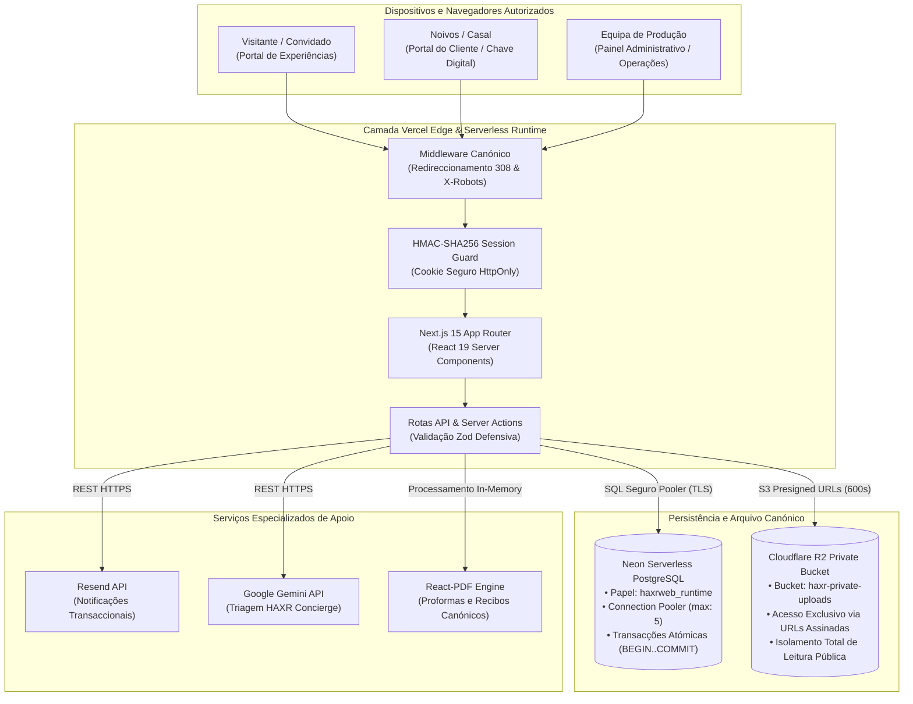

# HAXR Signature — Alta-Costura Digital

```text
  ██╗  ██╗ █████╗ ██╗  ██╗██████╗     ███████╗██╗ ██████╗ ███╗   ██╗ █████╗ ████████╗██╗   ██╗██████╗ ███████╗
  ██║  ██║██╔══██╗╚██╗██╔╝██╔══██╗    ██╔════╝██║██╔════╝ ████╗  ██║██╔══██╗╚══██╔══╝██║   ██║██╔══██╗██╔════╝
  ███████║███████║ ╚███╔╝ ██████╔╝    ███████╗██║██║  ███╗██╔██╗ ██║███████║   ██║   ██║   ██║██████╔╝█████╗  
  ██╔══██║██╔══██║ ██╔██╗ ██╔══██╗    ╚════██║██║██║   ██║██║╚██╗██║██╔══██║   ██║   ██║   ██║██╔══██╗██╔══╝  
  ██║  ██║██║  ██║██╔╝ ██╗██║  ██║    ███████║██║╚██████╔╝██║ ╚████║██║  ██║   ██║   ╚██████╔╝██║  ██║███████╗
  ╚═╝  ╚═╝╚═╝  ╚═╝╚═╝  ╚═╝╚═╝  ╚═╝    ╚══════╝╚═╝ ╚═════╝ ╚═╝  ╚═══╝╚═╝  ╚═╝   ╚═╝    ╚═════╝ ╚═╝  ╚═╝╚══════╝
                               PRIVATE PLANNING ATELIER & OPERATIONAL ENGINE
```

> **Manifesto de Engenharia e Alta-Costura Digital**  
> O luxo contemporâneo não reside no excesso ornamental ou em artifícios efémeros. Reside na precisão milimétrica, no respeito pelo espaço e na harmonia indissolúvel entre a estética editorial e uma arquitectura de software imune a falhas. Nos bastidores de cada celebração irrepetível em Moçambique, a tecnologia da HAXR Signature opera como um sistema operativo invisível: silencioso, seguro, veloz e rigorosamente estruturado para libertar a emoção à frente.

---

## Estado Canónico da Arquitectura

| Dimensão | Estado de Produção | Referência Técnica |
| :--- | :--- | :--- |
| **Ambiente Canónico** | `https://www.haxrsignature.com` | Domínio institucional e administrativo primário |
| **Motor de Convites (Edition)** | `https://edition.haxrsignature.com` | Roteamento dinâmico de celebrações privadas |
| **Repositório Central** | `MrDimande/haxrsignatureweb` | Monorepo de operações e marketing editorial |
| **Estado de Migração** | `FECHADA (CLOSED)` | Selo: `supabase-exit-2026-09-06` |
| **Dependência Supabase Runtime** | `ZERO (0.00%)` | Totalmente erradicada em produção |
| **Base de Dados Canónica** | `Neon Serverless PostgreSQL` | Pooler pgBouncer activo (`sslmode=require`) |
| **Armazenamento Privado** | `Cloudflare R2` | Bucket `haxr-private-uploads` (100% privado) |
| **Higiene e Auditoria** | `APROVADA` | Conformidade estrita sem exposição de segredos |

---

## Pilha Tecnológica Canónica (Technology Stack)

A tabela seguinte reflecte rigorosamente as dependências e versões instaladas e em execução activa no projecto (`package.json` e `package-lock.json`), sem aproximações ou versões presumidas:

| Camada Arquitectural | Tecnologia / Pacote | Versão Instalada | Finalidade no Projecto |
| :--- | :--- | :--- | :--- |
| **Framework Web** | `Next.js` | `15.5.19` | App Router, Server Components, Server Actions e API Routes |
| **Biblioteca de Interface** | `React` / `React DOM` | `19.1.0` | Renderização concorrente e componentes de alta-costura |
| **Linguagem de Tipagem** | `TypeScript` | `5.8.3` | Tipagem estrita de contratos de dados e segurança de código |
| **Ambiente de Execução** | `Node.js` | `^22.13.0` / `24.x LTS` | Runtime serverless em produção (Vercel) e desenvolvimento local |
| **Estilos & Design System** | `Tailwind CSS` | `4.1.7` (`@tailwindcss/postcss`) | Motor CSS moderno de alta performance e design editorial |
| **Animação & Motion** | `GSAP` | `3.13.0` | Coreografia visual de entrada, scroll suave e transições |
| **Micro-Interacções** | `Framer Motion` | `12.9.2` | Transições de modais, diálogos e componentes reactivos |
| **Base de Dados Principal** | `PostgreSQL (Neon)` | `pg ^8.21.0` | Driver nativo com pooling pgBouncer e disciplina transaccional |
| **SDK Neon Serverless** | `@neondatabase/serverless` | `^1.0.2` | Conexões optimizadas para ambientes edge e serverless |
| **Armazenamento de Objectos**| `@aws-sdk/client-s3` | `^3.1125.0` | Cliente oficial S3 para o Cloudflare R2 |
| **Segurança de Objectos** | `@aws-sdk/s3-request-presigner`| `^3.1126.0` | Emissão de URLs assinadas temporárias com prazo curto |
| **Validação de Esquemas** | `Zod` | `^3.25.28` | Validação defensiva de formulários, dados de entrada e APIs |
| **Gestão de Formulários** | `React Hook Form` | `^7.56.3` | Gestão de formulários complexos acoplada a `@hookform/resolvers` (`^5.0.1`) |
| **Criptografia & Sessões** | `Jose` | `^6.2.10` | Manipulação criptográfica de tokens e assinaturas de sessão |
| **Serviço de Email** | `Resend` | `^6.12.4` | Transmissão de notificações operacionais e confirmações |
| **Geração de Documentos** | `@react-pdf/renderer` | `^4.5.1` | Emissão programática de proformas e recibos contratuais em PDF |
| **Manipulação de Folhas** | `ExcelJS` | `^4.4.0` | Exportação de listas de convidados e tabelas de assentos |
| **Inteligência Artificial** | `@google/generative-ai` | `^0.24.1` | Motor assistivo HAXR Concierge para triagem de pedidos |
| **Iconografia Editorial** | `Lucide React` | `^1.16.0` | Ícones minimalistas curados (sem símbolos mágicos/infantis) |
| **Testes Automatizados** | Node Test Runner / `tsx` | `tsx ^4.22.4` | Execução de testes unitários e testes de regressão de integração |
| **Plataforma de Alojamento** | `Vercel` | Edge / Serverless | Deployment atómico contínuo acoplado ao branch `main` |

---

## Diagrama da Arquitectura de Produção



---

## Domínios Centrais da Aplicação

1. **Atelier Editorial & Portfólio:** Apresentação curada da assinatura artística, serviços de assessoria, catálogo de experiências e ferramentas públicas para casais.
2. **Painel Operacional Administrativo (`/admin`):** Controlo integral de clientes, propostas comerciais, orçamentos, calendários de eventos, alocação de equipas e conciliação de pagamentos.
3. **Gestão Estruturada de Convidados (RSVP & Seating):** Controlo granular de presenças, restrições alimentares, acompanhantes autorizados e desenho do mapa de mesas (*Floor Plan*).
4. **Validação de Check-in em Tempo Real:** Interface ultra-rápida para o dia do evento (`/event/[eventId]/checkin/[token]`) com busca interactiva (*Find Your Seat*).
5. **Directório de Fornecedores & Parceiros:** Curadoria de profissionais de eventos de elite em Moçambique, com categorização estética e histórico de fiabilidade.
6. **HAXR Concierge Assistido por IA:** Assistente de triagem interna que analisa solicitações de noivos, sugere alocações orçamentais e organiza informações preliminares sem decisões contratuais automatizadas.
7. **Arquivo Documental Privado:** Armazenamento encriptado e custódia segura de contratos, propostas e comprovativos bancários com URLs assinadas efémeras.

---

## Modelo de Segurança & Princípios de Menor Privilégio

- **Papel de Runtime Restrito:** A aplicação conecta-se à base de dados exclusivamente sob o utilizador `haxrweb_runtime`, impedido de executar comandos DDL (`DROP`, `ALTER`, `TRUNCATE`) ou aceder a tabelas de auditoria do sistema.
- **Isolamento Total de Ficheiros:** Nenhum ficheiro no Cloudflare R2 possui URL pública aberta. Todos os acessos ocorrem através de URLs pré-assinadas com prazo máximo de 10 minutos (600 segundos).
- **Protecção Contra Path Traversal:** O utilitário central `assertSafeStoragePath` rejeita rigorosamente qualquer tentativa de manipulação de directórios (`..`, barras duplas ou carateres nulos).
- **Sessão Administrativa Robusta:** Sessões baseadas em cookies criptográficos `httpOnly`, `SameSite=Lax`, assinados via HMAC-SHA256 (`ADMIN_SESSION_SECRET`).
- **Segredos Isolados do Cliente:** Todas as credenciais de infraestrutura (chaves S3, chaves de API, credenciais de dados) operam estritamente no servidor e nunca recebem o prefixo `NEXT_PUBLIC_`.

---

## Ambiente de Desenvolvimento Local

### Pré-requisitos
- Node.js versão 22.x LTS ou superior (compatível com Node.js 24)
- npm 10+
- Acesso à instância de dados de desenvolvimento Neon e bucket de testes Cloudflare R2

### Instalação e Execução

```bash
# Clonar o repositório oficial
git clone https://github.com/MrDimande/haxrsignatureweb.git
cd haxrsignatureweb

# Instalar dependências estritas
npm install

# Iniciar servidor local em http://localhost:3000
npm run dev

# Validação estrita de tipos TypeScript
npx tsc --noEmit

# Executar linter de código
npm run lint

# Executar build de produção para validação
npm run build
```

---

## Variáveis de Ambiente Canónicas

As variáveis devem ser configuradas exclusivamente no ficheiro `.env.local` (ignorado de forma estrita pelo Git). **Nunca versione ficheiros de ambiente com valores reais.**

| Nome da Variável | Obrigatória | Âmbito | Descrição e Finalidade |
| :--- | :---: | :--- | :--- |
| `DATABASE_URL` | **Sim** | Servidor | Conexão pooled do Neon PostgreSQL (`sslmode=require`) |
| `DATABASE_URL_UNPOOLED` | Não | Servidor | Conexão directa para operações estruturais e migrações |
| `HAXR_DATABASE_PROVIDER` | **Sim** | Servidor | Provedor canónico de base de dados (`neon`) |
| `HAXR_PRIVATE_STORAGE_PROVIDER` | **Sim** | Servidor | Provedor canónico de ficheiros privados (`r2-s3`) |
| `CLOUDFLARE_R2_PRIVATE_ACCOUNT_ID` | **Sim** | Servidor | Identificador da conta de infraestrutura Cloudflare |
| `CLOUDFLARE_R2_PRIVATE_ACCESS_KEY_ID`| **Sim** | Servidor | Chave de acesso S3 para o bucket `haxr-private-uploads` |
| `CLOUDFLARE_R2_PRIVATE_SECRET_ACCESS_KEY` | **Sim** | Servidor | Chave secreta de autenticação S3 para o Cloudflare R2 |
| `CLOUDFLARE_R2_PRIVATE_ENDPOINT` | **Sim** | Servidor | Endpoint HTTPS S3 do Cloudflare R2 |
| `CLOUDFLARE_R2_PRIVATE_BUCKET` | **Sim** | Servidor | Nome do bucket privado (`haxr-private-uploads`) |
| `ADMIN_EMAIL` | **Sim** | Servidor | Endereço de email do utilizador administrador |
| `ADMIN_PASSWORD` | **Sim** | Servidor | Palavra-passe do utilizador administrador |
| `ADMIN_SESSION_SECRET` | **Sim** | Servidor | Segredo criptográfico para assinatura HMAC de sessões |
| `RESEND_API_KEY` | **Sim** | Servidor | Chave da API Resend para emails transaccionais |
| `BREVO_API_KEY` | Não | Servidor | Chave de integração comercial do Brevo (CRM) |
| `GEMINI_API_KEY` | Não | Servidor | Chave da API Google Gemini para o HAXR Concierge |
| `NEXT_PUBLIC_SITE_URL` | **Sim** | Público | Domínio oficial da plataforma (`https://www.haxrsignature.com`) |

---

## Testes & Validação Operacional

O projecto inclui ferramentas operacionais dedicadas para validação contínua da saúde dos sistemas:

```bash
# Validação da saúde canónica de produção (rotas, admin, check-in, leitura R2)
node scripts/test-canonical-health.cjs

# Validação estrita de credenciais e permissões R2
node scripts/validate-private-r2-credential.cjs

# Auditoria de integridade e leitura de ficheiros em Cloudflare R2
node scripts/validate-production-read.cjs

# Inventário de leitura e verificação de integridade SHA-256
node scripts/verify-r2-read-only-inventory.mjs

# Execução da suite de testes de SEO e integridade
npm test
```

---

## Deployment & Pipeline de Produção

- **Plataforma:** A infraestrutura é implantada de forma contínua na **Vercel** através da integração com o repositório GitHub.
- **Ambientes de Pré-visualização:** Cada Pull Request origina um ambiente efémero e isolado para testes de regressão antes da fusão de código.
- **Produção:** Actualizações no branch `main` desencadeiam a validação de tipagem, compilação de activos e implementação com zero tempo de inactividade (*zero-downtime deployment*).
- **Cabeçalhos de Segurança:** Configuração activa de cabeçalhos contra ataques de clique (*frame-ancestors*), protecção XSS e isolamento de recursos.

---

## Recuperação de Desastres & Política de Continuidade

1. **Base de Dados (Neon PostgreSQL):** Salvaguardas contínuas em tempo real com capacidade de restauro pontual no tempo (*Point-in-Time Recovery - PITR*), complementadas por ramificações instantâneas (*database branching*) para ensaio prévio de intervenções críticas.
2. **Armazenamento de Ficheiros (Cloudflare R2):** Distribuição geográfica e redundância de objectos contra perdas físicas de dados.
3. **Princípio de Resposta Operacional (*Repair-Forward*):** Em caso de falha ou anomalia, a resolução obrigatória consiste na correcção evolutiva directa no código e implementação imediata. Não é permitido o restauro cego a partir do arquivo histórico da Supabase, dado que este constitui um repositório frio estático anterior ao corte definitivo.

---

## Estrutura do Repositório

```text
haxrsignatureweb/
├── docs/
│   ├── audits/              # Auditorias de licenciamento, privacidade, conformidade e SEO
│   ├── migrations/          # Relatórios técnicos, diários de transferência e manifests de migração
│   └── venues/              # Base de investigação editorial e padrão de verificação de locais
├── public/                  # Tipografia própria, logótipos e activos visuais de alta joalharia
├── scripts/                 # Utilitários de auditoria de segredos, validação R2 e testes de produção
├── src/
│   ├── app/                 # Next.js App Router (marketing editorial, administração, APIs)
│   ├── components/          # Componentes modulares reactivos desenhados sob o padrão de alta-costura
│   ├── hooks/               # Hooks de interacção local, detecção de movimento e viewport
│   ├── lib/
│   │   ├── admin/           # Lógica do painel de operações, autenticação e guardas de sessão
│   │   ├── concierge/       # Motor assistivo HAXR Concierge
│   │   ├── neon/            # Abstração de conexões, pooler pgBouncer e clientes Neon
│   │   ├── storage/         # Gestão de objectos, presigned URLs e segurança de caminhos Cloudflare R2
│   │   ├── seo/             # Metadados canónicos, dados estruturados JSON-LD e sitemaps
│   │   └── site-config.ts   # Fonte única de verdade de conteúdos institucionais e contactos
│   └── middleware.ts        # Redireccionamentos 308, protecção de rotas administrativas e SEO
├── package.json             # Definição rigorosa de versões e comandos operacionais
└── tsconfig.json            # Configuração estrita de compilação TypeScript
```

---

## Enquadramento Legal & Licenciamento

- **Código Proprietário:** O código-fonte deste repositório, bem como os desenhos visuais, identidades de alta-costura e soluções arquitecturais constituem propriedade intelectual confidencial e exclusiva da HAXR Signature. Todos os direitos reservados.
- **Bibliotecas de Terceiros:** As dependências externas de código aberto respeitam as suas respectivas licenças (MIT, Apache-2.0, BSD-3-Clause, ISC), devidamente catalogadas na documentação de auditoria.
- **Auditoria de Licenciamento:** Consulte o documento completo em [`docs/audits/software-licensing-audit-2026.md`](./docs/audits/software-licensing-audit-2026.md).
