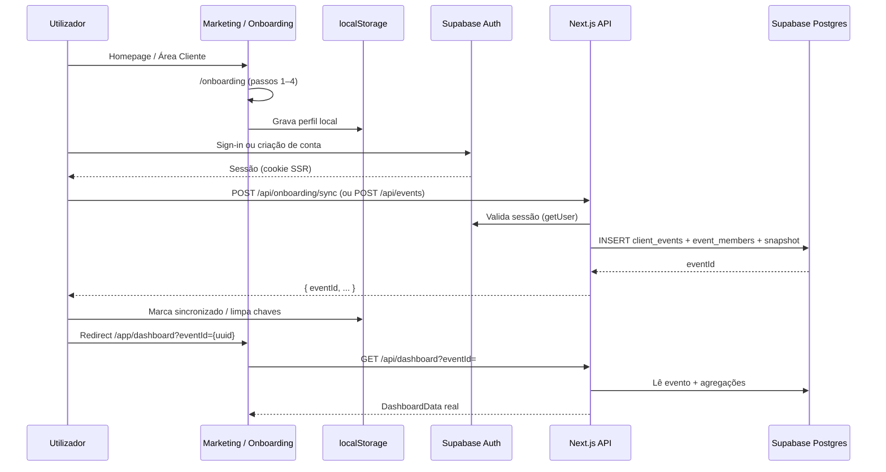

# HAXR Signature — Especificação: Auth Real + Criação de Evento a partir do Onboarding

**Estado:** Documentação aprovada para implementação (sem código nesta fase)
**Versão:** 1.0 · Julho 2026
**Pré-requisito:** P0 mínimo onboarding → dashboard (ponte `localStorage`) já implementado

**Fora de âmbito desta fase:**
- Dashboard Admin (`/admin/*`)
- HAXR Concierge (`/app/concierge`, `concierge_portal_*`)
- Implementação de código, migrations, commit ou deploy

---

## 1. Problema actual

### 1.1 Ponte temporária em `localStorage`

O wizard `/onboarding/profile/1–4` grava dados no browser com as chaves:

| Chave | Conteúdo |
|-------|----------|
| `haxr_onboarding_role` | `noiva` \| `consultor` |
| `haxr_onboarding_bride` | Nome da noiva |
| `haxr_onboarding_groom` | Nome do noivo |
| `haxr_onboarding_date` | Data ISO (`YYYY-MM-DD`) |
| `haxr_onboarding_location` | Local do evento |
| `haxr_onboarding_guests` | Nº estimado de convidados |
| `haxr_onboarding_budget` | Orçamento planeado (opcional) |
| `haxr_onboarding_phone` | Telemóvel WhatsApp |
| `haxr_onboarding_complete` | Flag `true` após passo 4 |

Módulos envolvidos (P0):
- `src/lib/auth/onboarding-storage.ts` — leitura e validação
- `src/lib/auth/onboarding-status.ts` — `isOnboardingComplete()`, redirects
- `src/lib/dashboard/onboarding-dashboard-adapter.ts` — `buildDashboardFromOnboardingStore()`
- `src/components/app/dashboard/DashboardPageClient.tsx` — guard client-side + adapter
- `src/hooks/use-app-event.ts` — nome do evento no header

### 1.2 Limitações da ponte

| Limitação | Impacto |
|-----------|---------|
| Sem persistência em BD | Dados perdidos ao limpar browser / outro dispositivo |
| Sem auth real | Qualquer pessoa com URL acede `/app/*` (guard só no client) |
| Sem `eventId` real | Rotas `/app/events/{slug}/...` usam slug derivado do nome, não UUID |
| Dashboard mockado | KPIs, convidados, financeiro são zeros/placeholders gerados no adapter |
| `events` operacional desligado | Tabela `events` existente (admin, `business_id`) não é alimentada pelo onboarding |
| Demo Jessica isolada | Só via `?demo=jessica-samuel`; não deve tornar-se default |

### 1.3 Contexto do schema existente

O projecto já tem:
- `events` — eventos operacionais (convidados, seating, sheets) ligados a `businesses`
- `clients` — clientes comerciais admin + `portal_token`
- Portal comercial em `/portal/[token]` — **separado** da app casal `/app/*`
- Auth admin via cookie HMAC — **não** reutilizável para clientes da app

Esta spec introduz **`client_events`** como camada de propriedade do utilizador autenticado (`auth.users`), sem substituir de imediato a tabela `events` operacional.

---

## 2. Objectivo da próxima fase

Quando o utilizador **conclui o onboarding** e **tem sessão Supabase Auth válida**, o sistema deve:

1. Criar um registo real em `client_events` (e relações associadas)
2. Associar o utilizador como `owner` em `event_members`
3. Guardar snapshot auditável do onboarding em `event_onboarding_snapshots`
4. Resolver o dashboard por `eventId` UUID — não por adapter `localStorage`
5. Sincronizar ou limpar dados locais após sucesso
6. Proteger `/app/*` com sessão server-side (middleware)

**Resultado esperado:** novo utilizador vê no dashboard os mesmos dados que preencheu no onboarding, mas vindos da BD.

---

## 3. Fluxo futuro recomendado



### 3.1 Decisão de ordem: onboarding antes ou depois do auth?

**Recomendação:** manter onboarding **antes** do sign-in (como hoje), para reduzir fricção comercial. O fluxo fica:

```
Homepage / Área Cliente
  → /onboarding (localStorage)
  → /sign-in (ou sign-up)
  → POST /api/onboarding/sync  ← preferido quando há dados locais
  → evento criado na BD
  → /app/dashboard?eventId={uuid}
```

**Alternativa (v2):** exigir auth no passo 1 do onboarding. Só adoptar se métricas mostrarem abandono aceitável.

### 3.2 Utilizador que já tem evento activo

| Cenário | Comportamento |
|---------|---------------|
| Login + onboarding local completo + **sem** evento na BD | Criar evento (sync) |
| Login + onboarding local + **já tem** evento activo | Não duplicar; redireccionar para evento existente; opcionalmente mostrar merge UI |
| Login + **sem** onboarding local + tem evento | `/app/dashboard?eventId=` do evento activo |
| Login + sem onboarding + sem evento | `/onboarding` |

---

## 4. Contrato da API `POST /api/events`

### 4.1 Resumo

| Campo | Valor |
|-------|-------|
| **URL** | `/api/events` |
| **Método** | `POST` |
| **Content-Type** | `application/json` |
| **Auth** | Sessão Supabase obrigatória (cookie `@supabase/ssr` ou `Authorization: Bearer <access_token>`) |
| **Idempotência** | Header `Idempotency-Key: <uuid>` **ou** deduplicação por `(owner_user_id, onboarding_fingerprint)` |

### 4.2 Payload mínimo

```json
{
  "eventType": "wedding",
  "eventName": "Jessica & Samuel",
  "brideName": "Jessica",
  "groomName": "Samuel",
  "eventDate": "2026-12-20",
  "eventLocation": "Maputo",
  "estimatedGuests": 150,
  "budgetMin": 80000,
  "budgetMax": 150000,
  "servicesInterested": ["convites_digitais", "rsvp", "assessoria"],
  "source": "onboarding",
  "plannerRole": "noiva",
  "phone": "+258841234567"
}
```

#### Mapeamento desde `localStorage` (P0)

| Campo API | Origem local |
|-----------|--------------|
| `eventType` | `"wedding"` se `role=noiva`, `"other"` ou `"wedding_planner"` se `consultor` (ver enum) |
| `eventName` | `{bride} & {groom}` |
| `brideName` | `haxr_onboarding_bride` |
| `groomName` | `haxr_onboarding_groom` |
| `eventDate` | `haxr_onboarding_date` |
| `eventLocation` | `haxr_onboarding_location` |
| `estimatedGuests` | `haxr_onboarding_guests` (int) |
| `budgetMin` | opcional; se só existe um valor local, usar `null` |
| `budgetMax` | `haxr_onboarding_budget` ou `null` |
| `phone` | `haxr_onboarding_phone` (normalizar `+258`) |
| `plannerRole` | `haxr_onboarding_role` |
| `servicesInterested` | `[]` por agora (campo reservado UI futura) |
| `source` | `"onboarding"` |

### 4.3 Validações (servidor)

| Campo | Regra |
|-------|-------|
| `eventType` | Enum: `wedding`, `birthday`, `corporate`, `baby_shower`, `graduation`, `other` |
| `eventName` | 2–120 chars, trim |
| `brideName`, `groomName` | 1–80 chars cada |
| `eventDate` | ISO date `YYYY-MM-DD`; ≥ hoje − 30 dias (eventos muito antigos → aviso, não bloqueio hard) |
| `eventLocation` | 2–200 chars |
| `estimatedGuests` | int 1–5000 |
| `budgetMin`, `budgetMax` | int ≥ 0; se ambos presentes, `budgetMin <= budgetMax` |
| `phone` | E.164 Moçambique preferido (`+258...`) |
| `servicesInterested` | array de strings conhecidas, max 20 |
| `source` | `onboarding` \| `manual` \| `import` |

### 4.4 Resposta de sucesso `201 Created`

```json
{
  "ok": true,
  "data": {
    "eventId": "550e8400-e29b-41d4-a716-446655440000",
    "slug": "jessica-samuel",
    "status": "planning",
    "createdAt": "2026-07-09T12:00:00.000Z",
    "isActive": true,
    "redirectTo": "/app/dashboard?eventId=550e8400-e29b-41d4-a716-446655440000"
  }
}
```

### 4.5 Respostas de erro

| HTTP | `error` | Quando |
|------|---------|--------|
| `401` | `unauthorized` | Sem sessão ou token inválido |
| `403` | `forbidden` | Conta desactivada / email não confirmado (se política activa) |
| `400` | `validation_error` | Payload inválido + `details: [{ field, message }]` |
| `409` | `active_event_exists` | Utilizador já tem evento activo (ver idempotência) |
| `409` | `duplicate_onboarding` | Mesmo fingerprint já sincronizado |
| `422` | `onboarding_incomplete` | Chamado via sync sem dados obrigatórios |
| `500` | `database_error` | Falha Supabase (sem expor SQL) |
| `503` | `auth_unavailable` | Supabase Auth indisponível |

Exemplo `400`:

```json
{
  "ok": false,
  "error": "validation_error",
  "message": "Dados do evento inválidos.",
  "details": [
    { "field": "eventDate", "message": "Data inválida." }
  ]
}
```

### 4.6 Idempotência

**Objectivo:** evitar eventos duplicados em double-submit, refresh ou retry de rede.

Estratégia recomendada (combinar):

1. **Header `Idempotency-Key`** — UUID gerado no client no primeiro submit; servidor guarda resultado 24h (tabela `api_idempotency_keys` ou coluna em snapshot).
2. **Fingerprint de onboarding** — hash estável de `(brideName, groomName, eventDate, location, guests, phone)` por `owner_user_id`.
3. **Regra de negócio** — máximo **1 evento activo** por utilizador `client` na fase MVP (configurável depois).

Comportamento:

| Situação | Resposta |
|----------|----------|
| Mesmo `Idempotency-Key` | `200` com mesmo `eventId` (replay seguro) |
| Mesmo fingerprint, evento activo existe | `409 active_event_exists` + `existingEventId` |
| Novo pedido, utilizador sem evento | `201` cria novo |

### 4.7 Utilizador com evento activo

```json
{
  "ok": false,
  "error": "active_event_exists",
  "message": "Já tem um evento em planeamento.",
  "existingEventId": "550e8400-e29b-41d4-a716-446655440000",
  "redirectTo": "/app/dashboard?eventId=550e8400-e29b-41d4-a716-446655440000"
}
```

**Política MVP:** não criar segundo evento automaticamente. UI pode oferecer «Criar novo evento» como acção explícita (fase posterior).

---

## 5. Contratos auxiliares

### 5.1 `GET /api/events`

Lista eventos do utilizador autenticado.

| Campo | Valor |
|-------|-------|
| Auth | Obrigatória |
| Query | `?status=planning\|active\|archived` (opcional), `?limit=20` |

**Resposta `200`:**

```json
{
  "ok": true,
  "data": {
    "events": [
      {
        "id": "uuid",
        "eventName": "Jessica & Samuel",
        "eventType": "wedding",
        "eventDate": "2026-12-20",
        "status": "planning",
        "isActive": true,
        "role": "owner"
      }
    ],
    "activeEventId": "uuid"
  }
}
```

### 5.2 `GET /api/events/:id`

Detalhe de um evento. O servidor valida membership antes de devolver.

| HTTP | Quando |
|------|--------|
| `200` | Membro ou equipa HAXR atribuída |
| `403` | Evento de outro utilizador |
| `404` | ID inexistente |

```json
{
  "ok": true,
  "data": {
    "id": "uuid",
    "eventName": "Jessica & Samuel",
    "brideName": "Jessica",
    "groomName": "Samuel",
    "eventDate": "2026-12-20",
    "eventLocation": "Maputo",
    "estimatedGuests": 150,
    "budgetMin": 80000,
    "budgetMax": 150000,
    "status": "planning",
    "source": "onboarding",
    "slug": "jessica-samuel",
    "createdAt": "...",
    "updatedAt": "..."
  }
}
```

### 5.3 `GET /api/dashboard?eventId=`

**Nota:** hoje existe `GET /api/events/[eventId]/dashboard`. Na fase real, unificar para um dos dois (recomendação: manter path existente e adicionar alias).

| Campo | Valor |
|-------|-------|
| URL preferida | `GET /api/events/:eventId/dashboard` (já existe) |
| Alias opcional | `GET /api/dashboard?eventId=` → proxy interno |
| Auth | Obrigatória + verificação `event_members` |

**Resposta:** envelope `DashboardDataResult` actual (`src/lib/dashboard/types.ts`).

```json
{
  "ok": true,
  "data": {
    "eventOverview": { "eventId": "uuid", "name": "...", "...": "..." },
    "meta": { "...": "..." },
    "stats": [],
    "...": "..."
  }
}
```

Fonte de dados: agregações reais (convidados, orçamento, tarefas) quando disponíveis; fallback mínimo a partir de `client_events` se módulos ainda vazios.

### 5.4 `POST /api/onboarding/sync`

Endpoint dedicado à migração one-time do `localStorage`.

| Campo | Valor |
|-------|-------|
| URL | `/api/onboarding/sync` |
| Método | `POST` |
| Auth | Obrigatória |
| Body | Opcional — se vazio, servidor **não** lê localStorage (impossível no server); client envia payload derivado do local |

**Body recomendado:**

```json
{
  "onboarding": {
    "role": "noiva",
    "brideName": "Jessica",
    "groomName": "Samuel",
    "eventDate": "2026-12-20",
    "eventLocation": "Maputo",
    "estimatedGuests": 150,
    "budgetMax": 150000,
    "phone": "+258841234567"
  },
  "localFingerprint": "sha256:...",
  "idempotencyKey": "uuid"
}
```

**Fluxo interno:**
1. Validar sessão
2. Validar onboarding completo (mesmas regras que `isOnboardingComplete()`)
3. Se já sincronizado (`event_onboarding_snapshots.local_fingerprint`) → `200` com `eventId` existente
4. Senão → transacção: `POST /api/events` lógica + snapshot + `201`

**Resposta `201`:**

```json
{
  "ok": true,
  "data": {
    "eventId": "uuid",
    "synced": true,
    "clearedLocalKeys": true,
    "redirectTo": "/app/dashboard?eventId=uuid"
  }
}
```

---

## 6. Schema mínimo em Supabase SQL

> **Referência principal:** SQL abaixo para migration futura (ex. `036_client_app_auth.sql`).
> Não executar nesta fase.

### 6.1 Extensões e enums

```sql
-- Roles de membro do evento (app casal / planner)
DO $$ BEGIN
  CREATE TYPE client_event_member_role AS ENUM ('owner', 'partner', 'planner', 'viewer');
EXCEPTION WHEN duplicate_object THEN NULL;
END $$;

DO $$ BEGIN
  CREATE TYPE client_event_status AS ENUM ('planning', 'active', 'completed', 'archived');
EXCEPTION WHEN duplicate_object THEN NULL;
END $$;

DO $$ BEGIN
  CREATE TYPE app_user_role AS ENUM ('client', 'team', 'admin');
EXCEPTION WHEN duplicate_object THEN NULL;
END $$;
```

### 6.2 `profiles`

Extensão de `auth.users` para dados de app (não usar `user_metadata` para autorização).

```sql
CREATE TABLE IF NOT EXISTS profiles (
  id UUID PRIMARY KEY REFERENCES auth.users(id) ON DELETE CASCADE,
  full_name TEXT,
  phone TEXT,
  planner_role TEXT,                    -- noiva | consultor (preferência UI)
  app_role app_user_role NOT NULL DEFAULT 'client',
  active_client_event_id UUID,          -- FK adicionada após client_events
  onboarding_synced_at TIMESTAMPTZ,
  created_at TIMESTAMPTZ NOT NULL DEFAULT now(),
  updated_at TIMESTAMPTZ NOT NULL DEFAULT now()
);

CREATE INDEX IF NOT EXISTS idx_profiles_app_role ON profiles (app_role);
CREATE INDEX IF NOT EXISTS idx_profiles_active_event ON profiles (active_client_event_id);

CREATE TRIGGER profiles_updated_at
  BEFORE UPDATE ON profiles
  FOR EACH ROW EXECUTE FUNCTION set_updated_at();
```

**Trigger de criação automática** (padrão Supabase):

```sql
CREATE OR REPLACE FUNCTION handle_new_user()
RETURNS TRIGGER
LANGUAGE plpgsql
SECURITY DEFINER
SET search_path = public
AS $$
BEGIN
  INSERT INTO public.profiles (id, full_name, phone)
  VALUES (
    NEW.id,
    COALESCE(NEW.raw_user_meta_data->>'full_name', ''),
    COALESCE(NEW.raw_user_meta_data->>'phone', '')
  )
  ON CONFLICT (id) DO NOTHING;
  RETURN NEW;
END;
$$;

-- Trigger em auth.users (aplicar via migration Supabase)
```

### 6.3 `client_events`

```sql
CREATE TABLE IF NOT EXISTS client_events (
  id UUID PRIMARY KEY DEFAULT gen_random_uuid(),
  owner_user_id UUID NOT NULL REFERENCES auth.users(id) ON DELETE RESTRICT,
  slug TEXT NOT NULL,
  event_name TEXT NOT NULL,
  event_type event_type NOT NULL DEFAULT 'wedding',
  bride_name TEXT NOT NULL,
  groom_name TEXT NOT NULL,
  event_date DATE,
  event_location TEXT NOT NULL DEFAULT '',
  estimated_guests INTEGER NOT NULL DEFAULT 0,
  budget_min BIGINT,
  budget_max BIGINT,
  status client_event_status NOT NULL DEFAULT 'planning',
  source TEXT NOT NULL DEFAULT 'onboarding',
  services_interested TEXT[] NOT NULL DEFAULT '{}',
  phone TEXT,
  operational_event_id UUID REFERENCES events(id) ON DELETE SET NULL,
  is_active BOOLEAN NOT NULL DEFAULT true,
  onboarding_fingerprint TEXT,
  created_at TIMESTAMPTZ NOT NULL DEFAULT now(),
  updated_at TIMESTAMPTZ NOT NULL DEFAULT now(),
  CONSTRAINT client_events_guests_positive CHECK (estimated_guests >= 0),
  CONSTRAINT client_events_budget_range CHECK (
    budget_min IS NULL OR budget_max IS NULL OR budget_min <= budget_max
  )
);

CREATE UNIQUE INDEX IF NOT EXISTS idx_client_events_owner_fingerprint
  ON client_events (owner_user_id, onboarding_fingerprint)
  WHERE onboarding_fingerprint IS NOT NULL AND is_active = true;

CREATE INDEX IF NOT EXISTS idx_client_events_owner_active
  ON client_events (owner_user_id, is_active, created_at DESC);

CREATE INDEX IF NOT EXISTS idx_client_events_slug
  ON client_events (slug);

CREATE TRIGGER client_events_updated_at
  BEFORE UPDATE ON client_events
  FOR EACH ROW EXECUTE FUNCTION set_updated_at();

ALTER TABLE profiles
  ADD CONSTRAINT profiles_active_client_event_fk
  FOREIGN KEY (active_client_event_id) REFERENCES client_events(id) ON DELETE SET NULL;
```

**Relação com `events` operacional:** `operational_event_id` liga ao evento admin quando a equipa HAXR provisiona seating/sheets. Nullable na criação via onboarding.

### 6.4 `event_members`

```sql
CREATE TABLE IF NOT EXISTS event_members (
  id UUID PRIMARY KEY DEFAULT gen_random_uuid(),
  client_event_id UUID NOT NULL REFERENCES client_events(id) ON DELETE CASCADE,
  user_id UUID NOT NULL REFERENCES auth.users(id) ON DELETE CASCADE,
  role client_event_member_role NOT NULL DEFAULT 'owner',
  invited_email TEXT,
  accepted_at TIMESTAMPTZ,
  created_at TIMESTAMPTZ NOT NULL DEFAULT now(),
  updated_at TIMESTAMPTZ NOT NULL DEFAULT now(),
  UNIQUE (client_event_id, user_id)
);

CREATE INDEX IF NOT EXISTS idx_event_members_user
  ON event_members (user_id, created_at DESC);

CREATE TRIGGER event_members_updated_at
  BEFORE UPDATE ON event_members
  FOR EACH ROW EXECUTE FUNCTION set_updated_at();
```

### 6.5 `event_onboarding_snapshots`

Auditoria e suporte à idempotência / debug.

```sql
CREATE TABLE IF NOT EXISTS event_onboarding_snapshots (
  id UUID PRIMARY KEY DEFAULT gen_random_uuid(),
  client_event_id UUID NOT NULL REFERENCES client_events(id) ON DELETE CASCADE,
  owner_user_id UUID NOT NULL REFERENCES auth.users(id) ON DELETE CASCADE,
  local_fingerprint TEXT NOT NULL,
  payload JSONB NOT NULL,
  synced_from TEXT NOT NULL DEFAULT 'localStorage',
  idempotency_key TEXT,
  created_at TIMESTAMPTZ NOT NULL DEFAULT now(),
  UNIQUE (owner_user_id, local_fingerprint)
);

CREATE INDEX IF NOT EXISTS idx_onboarding_snapshots_event
  ON event_onboarding_snapshots (client_event_id);
```

### 6.6 Apêndice opcional — Prisma

Só relevante se o projecto adoptar Prisma para esta camada (hoje usa Supabase client directo). Modelo equivalente simplificado:

```prisma
model Profile {
  id                   String   @id @db.Uuid
  fullName             String?  @map("full_name")
  phone                String?
  appRole              String   @default("client") @map("app_role")
  activeClientEventId  String?  @map("active_client_event_id") @db.Uuid
  createdAt            DateTime @default(now()) @map("created_at")
  updatedAt            DateTime @updatedAt @map("updated_at")
  @@map("profiles")
}
```

> **Recomendação:** manter Supabase SQL + `database.types.ts` como fonte de verdade; Prisma só se houver decisão explícita de unificar ORM.

---

## 7. Campos mínimos por tabela

### `profiles`

| Campo | Tipo | Notas |
|-------|------|-------|
| `id` | UUID PK | = `auth.users.id` |
| `full_name` | TEXT | |
| `phone` | TEXT | Do onboarding / perfil |
| `planner_role` | TEXT | `noiva` \| `consultor` |
| `app_role` | ENUM | `client` default |
| `active_client_event_id` | UUID FK | Evento activo na UI |
| `onboarding_synced_at` | TIMESTAMPTZ | Quando sync concluiu |
| `created_at` | TIMESTAMPTZ | |
| `updated_at` | TIMESTAMPTZ | |

### `client_events`

| Campo | Tipo | Notas |
|-------|------|-------|
| `id` | UUID PK | `eventId` público |
| `owner_user_id` | UUID FK | Criador |
| `slug` | TEXT | URL-friendly, não único global |
| `event_name` | TEXT | Ex. «Ana & Carlos» |
| `event_type` | `event_type` | Reutiliza enum existente |
| `bride_name` | TEXT | |
| `groom_name` | TEXT | |
| `event_date` | DATE | |
| `event_location` | TEXT | |
| `estimated_guests` | INTEGER | |
| `budget_min` | BIGINT | Opcional |
| `budget_max` | BIGINT | Opcional |
| `status` | ENUM | `planning` default |
| `source` | TEXT | `onboarding` |
| `created_at` | TIMESTAMPTZ | |
| `updated_at` | TIMESTAMPTZ | |

### `event_members`

| Campo | Tipo | Notas |
|-------|------|-------|
| `id` | UUID PK | |
| `client_event_id` | UUID FK | |
| `user_id` | UUID FK | |
| `role` | ENUM | `owner` na criação |
| `created_at` | TIMESTAMPTZ | |
| `updated_at` | TIMESTAMPTZ | |

### `event_onboarding_snapshots`

| Campo | Tipo | Notas |
|-------|------|-------|
| `id` | UUID PK | |
| `client_event_id` | UUID FK | |
| `owner_user_id` | UUID FK | |
| `local_fingerprint` | TEXT | Hash estável |
| `payload` | JSONB | Cópia integral do onboarding |
| `synced_from` | TEXT | `localStorage` |
| `idempotency_key` | TEXT | Opcional |
| `created_at` | TIMESTAMPTZ | |

---

## 8. Segurança e RLS

### 8.1 Princípios

1. **RLS activo** em todas as tabelas `public` expostas
2. **`service_role` apenas no servidor** — `createAdminClient()` em API routes; nunca no browser
3. **Autorização em `app_role` / membership** — não em `user_metadata` (editável pelo utilizador)
4. **Políticas com `TO authenticated` + predicado de ownership** — nunca só `TO authenticated`

### 8.2 Função helper (recomendada)

```sql
CREATE OR REPLACE FUNCTION is_event_member(p_event_id UUID, p_roles TEXT[] DEFAULT NULL)
RETURNS BOOLEAN
LANGUAGE sql
STABLE
SECURITY INVOKER
SET search_path = public
AS $$
  SELECT EXISTS (
    SELECT 1
    FROM event_members em
    WHERE em.client_event_id = p_event_id
      AND em.user_id = (SELECT auth.uid())
      AND (p_roles IS NULL OR em.role::TEXT = ANY (p_roles))
  );
$$;
```

### 8.3 Políticas esperadas

#### `profiles`

| Operação | Quem |
|----------|------|
| SELECT | Próprio utilizador; `team`/`admin` via política separada |
| UPDATE | Próprio utilizador (`id = auth.uid()`) |
| INSERT | Trigger `handle_new_user` (service) |

#### `client_events`

| Operação | Política |
|----------|----------|
| SELECT | `owner_user_id = auth.uid()` OR `is_event_member(id)` OR equipa HAXR |
| INSERT | `owner_user_id = auth.uid()` |
| UPDATE | Owner ou `team` atribuído |
| DELETE | Não expor a clientes MVP (soft archive via `status`) |

#### `event_members`

| Operação | Política |
|----------|----------|
| SELECT | Membros do mesmo evento |
| INSERT | Owner do evento ou `team` |
| UPDATE/DELETE | Owner ou admin |

#### `event_onboarding_snapshots`

| Operação | Política |
|----------|----------|
| SELECT | Owner do evento |
| INSERT | Apenas via API server (service role) **ou** owner com validação |

### 8.4 Roles HAXR

| Role | `profiles.app_role` | Acesso |
|------|---------------------|--------|
| Cliente casal/planner | `client` | Só eventos onde é membro |
| Equipa HAXR | `team` | Eventos atribuídos (`event_members` com role `planner` ou tabela futura `team_event_assignments`) |
| Admin | `admin` | Todos (política explícita; não confundir com admin cookie actual) |

> **Nota:** o admin actual (`haxr_admin_session`) permanece independente. `app_role = admin` é para utilizadores Supabase com privilégios na app cliente, se necessário.

### 8.5 API routes

Todas as rotas `/api/events*`, `/api/dashboard*`, `/api/onboarding/*` devem:

1. Criar cliente Supabase server com cookies (`@supabase/ssr`)
2. `const { data: { user } } = await supabase.auth.getUser()` — **não** confiar só em `getSession()`
3. Operações de escrita via service role **apenas** quando RLS não cobre (ex. snapshot em transacção complexa), com validação prévia de `user.id`

---

## 9. Middleware / guard

### 9.1 Rotas a proteger

| Rota | Guard |
|------|-------|
| `/app/*` | Sessão Supabase obrigatória |
| `/app/dashboard` | Sessão + evento resolvido (query ou `active_client_event_id`) |
| `/app/events/*` | Sessão + membership no `eventId` da URL |
| `/api/events/*` | Sessão (excepto rotas públicas existentes: RSVP, check-in) |
| `/onboarding` | Se já tem evento activo **e** sync completo → redirect dashboard |

### 9.2 Implementação recomendada (`src/middleware.ts`)

Extender matcher actual (sem alterar protecção admin):

```ts
matcher: [
  "/app/:path*",
  "/api/events/:path*",
  "/api/onboarding/:path*",
  "/onboarding/:path*",
  // ... admin existente
]
```

Fluxo middleware `/app`:

```
1. createServerClient (@supabase/ssr) com cookies request/response
2. getUser()
3. Se !user → redirect /sign-in?from=/app/dashboard
4. Se /app/dashboard sem eventId:
     - tentar profiles.active_client_event_id
     - senão redirect /onboarding ou /api/events (lista) client-side
5. Passar request
```

### 9.3 `/onboarding` quando já existe evento

```
Se user autenticado
  AND profiles.active_client_event_id IS NOT NULL
  AND onboarding já sincronizado (onboarding_synced_at NOT NULL)
→ redirect /app/dashboard?eventId={active}
```

Permitir reentrada em `/onboarding` apenas se:
- sem sessão, ou
- sessão sem evento activo, ou
- query `?edit=1` (fase posterior)

### 9.4 Demo Jessica & Samuel

Manter **fora** do middleware de produção:

- `/app/dashboard?demo=jessica-samuel` só em `NODE_ENV=development` ou flag `ALLOW_DASHBOARD_DEMO=true`
- Em produção: `404` ou redirect sign-in

---

## 10. Migração do `localStorage`

### 10.1 Chaves novas (client)

| Chave | Valor |
|-------|-------|
| `haxr_onboarding_synced_event_id` | UUID após sync |
| `haxr_onboarding_synced_at` | ISO timestamp |
| `haxr_onboarding_local_fingerprint` | Hash para idempotência |

### 10.2 Fluxo após sign-in

```
1. Client: isOnboardingComplete() === true?
2. Client: já existe haxr_onboarding_synced_event_id?
   → SIM: redirect /app/dashboard?eventId=
   → NÃO: continuar
3. Client: POST /api/onboarding/sync { onboarding, localFingerprint, idempotencyKey }
4. Server: cria evento + snapshot + actualiza profiles.active_client_event_id
5. Client: guarda synced_event_id; limpa chaves haxr_onboarding_* (excepto synced_*)
6. Client: router.replace(/app/dashboard?eventId=)
```

### 10.3 Limpeza vs marcação

**Recomendação:** limpar chaves de wizard após sync bem-sucedido; manter apenas:

- `haxr_onboarding_synced_event_id`
- `haxr_onboarding_synced_at`

Se sync falhar: **não** limpar wizard — utilizador pode retry.

### 10.4 `localStorage` stale

Reutilizar lógica P0: se `haxr_onboarding_complete=true` mas faltam campos → tratar como incompleto, limpar flag, não chamar sync.

---

## 11. Dashboard real

### 11.1 Substituição do adapter

| Hoje (P0) | Fase real |
|-----------|-----------|
| `buildDashboardFromOnboardingStore(localStorage)` | `getDashboardDataFromEvent(eventId, userId)` |
| Client-only guard | Middleware + API auth |
| Stats sintéticos | Agregações BD + fallbacks |

### 11.2 Assinatura proposta

```ts
// src/lib/dashboard/get-dashboard-data.ts (futuro)

export async function getDashboardDataFromEvent(
  eventId: string,
  userId: string,
): Promise<DashboardDataResult> {
  // 1. Verificar event_members ou owner
  // 2. Ler client_events
  // 3. Agregar guests, budget, tasks (quando existirem)
  // 4. Mapear para DashboardData (manter contrato UI actual)
}
```

### 11.3 `getDashboardData(eventId?)` — comportamento futuro

```
1. Resolver userId da sessão server
2. eventId = param ?? profiles.active_client_event_id
3. Se !eventId → { ok: false, error: 'not_found' }
4. Se demo flag explícita → mock Jessica (só dev)
5. return getDashboardDataFromEvent(eventId, userId)
```

### 11.4 Componentes a actualizar (referência)

| Ficheiro | Mudança |
|----------|---------|
| `DashboardPageClient.tsx` | Remover bootstrap localStorage; fetch API com `eventId` |
| `use-app-event.ts` | Ler de `GET /api/events` ou session context |
| `app/layout.tsx` | Event name de API / context |
| `get-dashboard-data.ts` | BD em vez de mock default |

**UI:** manter `DashboardData` / `DashboardOverview` — só muda a fonte.

---

## 12. Estados e erros

| Estado | UX | Código |
|--------|-----|--------|
| Onboarding incompleto | Redirect `/onboarding` | `onboarding_incomplete` |
| Sem sessão em `/app` | Redirect `/sign-in?from=...` | `unauthorized` |
| Evento duplicado | Toast + redirect evento existente | `active_event_exists` |
| Data inválida | Erro inline no onboarding / API 400 | `validation_error` |
| Campos obrigatórios em falta | Bloquear passo 4 / API 422 | `validation_error` |
| Falha Supabase | Retry + mensagem genérica | `database_error` |
| localStorage stale | Limpar flag; reiniciar wizard | client-side |
| Evento não encontrado | Empty state dashboard | `not_found` |
| Sem permissão no evento | 403 + redirect lista eventos | `forbidden` |

---

## 13. Plano de implementação por fases

### Fase A — Documentação e schema
- [x] Este documento
- [ ] Review com equipa
- [ ] Migration `036_client_app_auth.sql` (draft)
- [ ] Actualizar `database.types.ts`

### Fase B — Supabase Auth
- [ ] `@supabase/ssr` + `createBrowserClient` / `createServerClient`
- [ ] Páginas `/sign-in`, `/sign-up`, callback `/auth/callback`
- [ ] Substituir stub em `sign-in-form.tsx`
- [ ] Trigger `handle_new_user` → `profiles`

### Fase C — `POST /api/events`
- [ ] Service `createClientEvent()`
- [ ] Validação Zod partilhada com onboarding
- [ ] Idempotência + fingerprint
- [ ] Testes integração

### Fase D — Middleware `/app`
- [ ] Extender `middleware.ts`
- [ ] Redirects sign-in / onboarding
- [ ] Bloquear demo em produção

### Fase E — Dashboard por `eventId` real
- [ ] `getDashboardDataFromEvent()`
- [ ] Actualizar `GET /api/events/[eventId]/dashboard`
- [ ] `DashboardPageClient` sem localStorage
- [ ] Header dinâmico via API

### Fase F — Sync `localStorage` → BD
- [ ] `POST /api/onboarding/sync`
- [ ] Hook pós-login `useOnboardingSync()`
- [ ] Limpeza chaves locais
- [ ] Actualizar `resolvePostLoginRedirect()`

### Fase G — Testes
- [ ] Unit + integração (ver secção 14)
- [ ] `npm test` + `npm run build`
- [ ] Smoke manual: novo utilizador end-to-end

---

## 14. Testes necessários

### API

| Teste | Tipo |
|-------|------|
| `POST /api/events` payload válido → `201` + UUID | Integração |
| Payload inválido → `400` + details | Unit (Zod) + integração |
| Sem sessão → `401` | Integração |
| Duplicação / idempotency → `409` ou replay `200` | Integração |
| `POST /api/onboarding/sync` com local completo | Integração |

### Autorização

| Teste | Tipo |
|-------|------|
| Utilizador A não vê evento de B (`GET /api/events/:id`) | Integração + RLS |
| `event_members` owner consegue SELECT | SQL policy test |

### Dashboard

| Teste | Tipo |
|-------|------|
| `getDashboardDataFromEvent` mapeia campos de `client_events` | Unit |
| Dashboard API com `eventId` real | Integração |
| Mock Jessica só com `?demo=` em dev | Unit |

### Client / middleware

| Teste | Tipo |
|-------|------|
| Middleware bloqueia `/app` sem sessão | E2E ou middleware unit |
| Sync localStorage → BD → limpa chaves | Unit (mock storage) + E2E |
| `isOnboardingComplete` + sync fingerprint | Unit (já parcialmente coberto P0) |

### Regressão P0

Manter testes existentes em:
- `src/lib/auth/onboarding-status.test.ts`
- `src/lib/dashboard/onboarding-dashboard-adapter.test.ts`

Até Fase F concluída; depois migrar para testes de sync.

---

## 15. Critérios de aceitação

- [ ] Novo utilizador completa onboarding → sign-in → evento criado na BD com UUID real
- [ ] Dashboard mostra `event_name`, data, local, convidados e orçamento **da BD**
- [ ] `/app/*` exige sessão Supabase (middleware server-side)
- [ ] Mock Jessica & Samuel **só** em modo demo explícito
- [ ] `localStorage` deixa de ser fonte principal após sync
- [ ] Utilizador só acede aos próprios eventos (RLS + API)
- [ ] `npm test` e `npm run build` passam
- [ ] Dashboard Admin e HAXR Concierge **inalterados**

---

## Resumo final

### 1. Resumo da arquitectura

A app casal (`/app/*`) passa de uma **ponte client-side** (`localStorage` → adapter) para um modelo **auth-first + evento persistido**:

- **Supabase Auth** com sessão SSR (`@supabase/ssr`)
- **`client_events`** como entidade de propriedade do utilizador
- **`event_members`** para RBAC futuro (parceiro, planner)
- **`event_onboarding_snapshots`** para auditoria e idempotência
- **API** `POST /api/events` e `POST /api/onboarding/sync` como pontos de criação
- **Dashboard** alimentado por `eventId` UUID via `getDashboardDataFromEvent()`
- **Middleware** protege `/app/*`; onboarding redirecciona se já sincronizado
- Tabela **`events` operacional** liga-se depois via `operational_event_id` (admin inalterado nesta fase)

### 2. Tabelas propostas

| Tabela | Função |
|--------|--------|
| `profiles` | Perfil app ligado a `auth.users` |
| `client_events` | Evento do cliente (onboarding → dashboard) |
| `event_members` | Quem acede a cada evento |
| `event_onboarding_snapshots` | Cópia auditável + fingerprint sync |

### 3. Endpoints propostos

| Método | Endpoint | Função |
|--------|----------|--------|
| `POST` | `/api/events` | Criar evento |
| `GET` | `/api/events` | Listar eventos do user |
| `GET` | `/api/events/:id` | Detalhe evento |
| `GET` | `/api/events/:id/dashboard` | Dashboard (existente, evoluir) |
| `GET` | `/api/dashboard?eventId=` | Alias opcional |
| `POST` | `/api/onboarding/sync` | Migrar localStorage → BD |

### 4. Riscos

| Risco | Mitigação |
|-------|-----------|
| Duplicação de eventos | Idempotency-Key + fingerprint + 1 evento activo MVP |
| Confusão `events` vs `client_events` | Documentar; FK `operational_event_id`; naming claro |
| RLS mal configurado (IDOR) | Policies com `auth.uid()`; testes; `supabase db advisors` |
| `user_metadata` em policies | Usar `profiles.app_role` apenas |
| Regressão Concierge/Admin | Escopo explícito; não alterar rotas/tabelas concierge |
| Onboarding antes do auth perde dados | Sync obrigatório pós-login; manter local até sync OK |
| Middleware + Supabase cookies em preview | Testar Vercel preview com env vars |
| Orçamento único no wizard vs min/max API | Mapear valor único para `budget_max`; `budget_min` null |

### 5. Próximo passo recomendado

**Fase A — validar e draft da migration**

1. Review desta spec com stakeholder (15 min)
2. Escrever `supabase/migrations/036_client_app_auth.sql` em branch separada
3. Aplicar em projeto Supabase **staging**
4. Correr `supabase db advisors` + testar policies manualmente
5. Só então iniciar **Fase B** (Supabase Auth no sign-in)

---

*Documento gerado para substituir a ponte P0. Não implementa código nem altera o repositório além deste ficheiro.*
