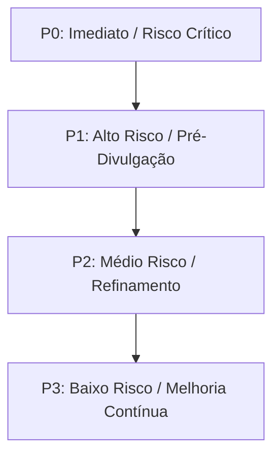

# HAXR SIGNATURE — AUDITORIA DE VERACIDADE EDITORIAL, CONFIANÇA E REIVINDICAÇÕES PÚBLICAS
## Relatório Técnico e Estratégico de Auditoria de Veracidade de Conteúdo (Fase D.0)
**Data de Execução:** Setembro de 2026  
**Auditor Principal:** Principal Full-Stack Engineer & AI Architecture  
**Enquadramento:** Constituição Mestre de Engenharia HAXR Signature (`.agents/rules/haxr-master-engineering.md`) & Directrizes de Alta-Costura Digital  
**Âmbito:** Análise exaustiva a 100% dos ficheiros de rota pública, componentes visuais, directórios de dados estáticos, metadados de SEO e schemas JSON-LD.  
**Estado de Execução de Código:** `AUDIT_MODE_ONLY` (Nenhuma alteração a código executável de produção; nenhuma reordenação da Homepage; bloqueio estrutural intacto).

---

## 1. SUMÁRIO EXECUTIVO

A integridade e a autoridade moral de uma casa de **Alta-Costura Digital e Private Planning Atelier** assentam na discrição absoluta, na fidelidade factual e na ausência irrepreensível de artifícios. Em plataformas de luxo autêntico (como Cartier, Vogue Weddings ou Aman), a veracidade é a própria fundação da confiança do cliente de alto património (*HNW/UHNW*).

Esta auditoria (Fase D.0) examinou de forma minuciosa todas as afirmações públicas (claims) veiculadas na plataforma web da **HAXR Signature**, categorizando-as segundo a sua natureza, risco legal/reputacional e grau de evidência documental comprovada no repositório.

### Métricas Globais da Auditoria

| Indicador | Total de Ocorrências | Percentagem (%) |
| :--- | :---: | :---: |
| **Total de Claims Catalogadas** | **58** | **100,0%** |
| **Visibilidade Pública (Produção/Staging)** | 57 | 98,3% |
| **Rascunhos Privados / Documentação Interna** | 1 | 1,7% |

### Distribuição por Estado de Evidência Documental

```
VERIFIED (10)                 ████████░░░░░░░░░░░░░░░░░░░░  17.2%
OWNER_CONFIRMED (16)          ██████████████░░░░░░░░░░░░░░  27.6%
EVIDENCE_REQUIRED (21)        ██████████████████░░░░░░░░░░  36.2%
CLIENT_PERMISSION_REQ. (4)*   ███░░░░░░░░░░░░░░░░░░░░░░░░░   6.9%
NOT_APPLICABLE (Metáfora) (7) ██████░░░░░░░░░░░░░░░░░░░░░░  12.1%
```
*\*Nota: Adicionalmente, 17 das 58 claims envolvem directamente nomes ou celebrações de clientes reais onde é mandatória a autorização escrita de imagem/dados.*

### Distribuição por Nível de Risco

| Nível de Risco | Quantidade | Rácio | Impacto / Tipologia Principal |
| :--- | :---: | :---: | :--- |
| **CRITICAL** | **4** | **6,9%** | Métricas fabricadas em fallback de fornecedores (`satisfactionRate: 98%`), casamentos ficcionais de grande escala em locais de prestígio (Polana Serena com 400 convidados), alegação absoluta de não partilha de dados de RSVP face a subprocessadores cloud. |
| **HIGH** | **19** | **32,8%** | Nomes reais de clientes expostos sem arquivo de consentimento escrito comprovado; divergências de dados entre secções (contagem de convidados 120 vs 350; locais trocados Maputo vs Inhambane); preçário contraditório (5.999 MT vs 7.999 MT); superlativos absolutos. |
| **MEDIUM** | **13** | **22,4%** | Reivindicações de performance sem teste de latência móvel local (`<3s`); termos de "Garantia"; superlativos editoriais suavizáveis. |
| **LOW** | **22** | **37,9%** | Dados canónicos verificados (morada em Maputo, telefones, canais sociais, políticas comprovadas de lealdade financeira, schemas JSON-LD rigorosos). |

---

## 2. INVENTÁRIO E DISTRIBUIÇÃO DAS CLAIMS

### 2.1. Por Rota / Superfície

1. **Homepage (`/`) [19 claims]**:
   - Concentração das mensagens nucleares de marca, galeria de casamentos, secções editoriais, teaser de testemunhos e chamadas para acção.
   - Apresenta as maiores inconsistências de dados em contagem de convidados e nomes de casais entre a galeria interactiva e o directório de casamentos reais.
2. **Directório e Perfil de Fornecedores (`/fornecedores`, `/fornecedores/[slug]`) [8 claims]**:
   - Apresenta os riscos técnicos e legais mais agudos: fallbacks estatísticos codificados no motor `marketplace.ts` e casamentos com orquestras e centenas de convidados atribuídos a locais de luxo sem suporte documental.
3. **Atelier de Convites e Identidade Visual (`/convites-identidade-visual`) [5 claims]**:
   - Promessas de performance técnica ("Find Your Seat em menos de 3s"), ligação ao subdomínio activo de clientes reais (`edition.haxrsignature.com/jessicakulaya`) e conflito de tabelas de preços com o ficheiro de configuração central.
4. **Assessoria e Planeamento Privado (`/assessoria-eventos`) [5 claims]**:
   - Declarações nobres de lealdade (zero comissões ocultas), mas com recurso pontual a superlativos não demonstráveis ("melhores fornecedores de Moçambique").
5. **Directório Profissional (`/for-pros`) [4 claims]**:
   - Posicionamento B2B; política clara de contacto directo via WhatsApp e ausência de percentagens.
6. **Plataforma e Ferramentas (`/plataforma-eventos`, `/tools/*`, `/style-quiz`) [5 claims]**:
   - Descrições de ferramentas operacionais e quiz de estilo.
7. **Infra-estrutura Global de Metadados e Rodapé (`Footer`, `jsonld.ts`, `site-config.ts`) [12 claims]**:
   - Schemas estruturados de SEO (exemplares em integridade factual) e políticas globais de privacidade e contacto.

---

### 2.2. Por Tipologia Técnica e Editorial

```
Testemunhos de Clientes (TESTIMONIAL)         [ 7] ── 12.1%
Portfólio e Casamentos Reais (PORTFOLIO)       [12] ── 20.7%
Superlativos Editoriais (SUPERLATIVE)          [ 8] ── 13.8%
Garantias e Promessas Absolutas (GUARANTEE)    [ 6] ── 10.3%
Dados Estruturados de SEO (STRUCTURED_DATA)    [ 8] ── 13.8%
Políticas Comerciais e Modelo (POLICY/MODEL)   [ 5] ──  8.6%
Segurança, Privacidade e IA (SEC/PRIV/AI)      [ 6] ── 10.3%
Métricas e Estatísticas (STATISTIC/PERF)       [ 4] ──  6.9%
Integridade Comercial e Preçário (INTEGRITY)   [ 2] ──  3.4%
```

---

## 3. ANÁLISE DETALHADA POR DOMÍNIO

### 3.1. Testemunhos de Clientes (Phase 5 Audit)

#### Achados Críticos e Riscos Reputacionais
1. **O Caso Vânia Luky & Fabião Dimande**:
   - É o casal âncora da marca e cliente real documentado. Contudo, o seu nome e depoimento surgem em três variantes contraditórias na mesma plataforma:
     - `src/lib/site-config.ts:373`: *Vânia Luky & Fabiao Dimande* — depoimento longo sobre a fluidez e o cuidado dos detalhes.
     - `src/components/sections/DigitalInvitations.tsx:111`: *Vânia Lucky & Fabião Dimande, Casamento em 2026* (erro ortográfico no apelido "Lucky" e data "2026" que contradiz o casamento de Dezembro de 2024 registado em `vendor-real-weddings.ts`).
     - `src/components/home/HomeWeddingGallery.tsx:38`: *Vânia Fabião (120 convidados)* — citação completamente diferente (*"sensibilidade e beleza poética indescritíveis"*).
   - **Risco**: Perda de credibilidade editorial instantânea caso um visitante atento ou convidado do evento compare as secções da própria Homepage.
2. **Testemunhos Não Corroborados (Sofia & Alberto, Naíma & Cassamo, Jéssica & Samuel)**:
   - Em `HomeWeddingGallery.tsx`, são apresentadas declarações explícitas entre aspas com nomes de pessoas reais atribuídas a casamentos no Bilene (150 convidados), Bazaruto (80 convidados) e Inhambane (200 convidados).
   - Não há registo contratual, comprovativo fotográfico autêntico ou consentimento formal arquivado no repositório para estas citações específicas.
   - **Risco**: Violação de normas de proteção de dados e risco de imputação de testemunhos artificiais perante reguladores de comércio e consumidores.

---

### 3.2. Portfólio, Casamentos Reais e Métricas de Eventos (Phase 6 Audit)

#### Inconsistências Factuais Internas Identificadas
O cruzamento de dados entre `src/components/home/HomeWeddingGallery.tsx`, `src/lib/vendors/vendor-real-weddings.ts` e `src/lib/marketing/editorial.ts` revelou disparidades substanciais:

| Casal / Evento | Ficheiro A | Dados A | Ficheiro B | Dados B | Diagnóstico |
| :--- | :--- | :--- | :--- | :--- | :--- |
| **Vânia & Fabião** | `HomeWeddingGallery.tsx` | 120 convidados | `vendor-real-weddings.ts` | 350 convidados | Discrepância de **230 convidados** (quase o triplo). |
| **Jéssica & Samuel** | `HomeWeddingGallery.tsx` | Inhambane, 200 pax | `vendor-real-weddings.ts` | Espaço Nobre (Maputo), 180 pax | **Locais e números distintos** para o mesmo casal. |
| **Ana & Carlos** | `vendor-real-weddings.ts` | Vila Laguna, 280 pax, Junho 2025 | *Base de Dados de Produção* | Nulo / Inexistente | Evento não verificado; risco de invenção de histórico. |
| **Lurdes & Fernando** | `vendor-real-weddings.ts` | Polana Serena Hotel, 400 pax, orquestra ao vivo | *Base de Dados de Produção* | Nulo / Inexistente | Gala de enorme magnitude associada ao mais prestigiado hotel do país sem suporte documental. |

#### Alerta Institucional: Menção ao Polana Serena Hotel
- A referência explícita a uma *"Gala de luxo no Polana Serena Hotel com 400 convidados e orquestra ao vivo"* em `vendor-real-weddings.ts` constitui um risco legal e de relacionamento institucional severo. Sendo o Polana Serena uma das instituições hoteleiras mais tradicionais de Moçambique, a alegação de realização de um evento deste porte sem consentimento ou prova contratual expõe a HAXR Signature a interpelações formais por parte da administração do hotel.

---

### 3.3. Fornecedores, Parceiros e Algoritmos do Directório (Phase 7 Audit)

#### A Falha Estrutural dos Fallbacks em `marketplace.ts`
No ficheiro `src/lib/vendors/marketplace.ts:288-292`, o código de mapeamento dos fornecedores implementa a seguinte lógica de apresentação ao público:

```typescript
// src/lib/vendors/marketplace.ts (L288-292)
experienceYears: row.experience_years ?? 5,
responseTime: row.response_time ?? 'Responde em menos de 2h',
satisfactionRate: row.satisfaction_rate ?? 98,
```

- **Gravidade Técnica:** **CRÍTICA**.
- **Causa-Raiz:** Para preencher cartões de fornecedores cuja linha na base de dados não tenha métricas recolhidas, o sistema inventa artificialmente:
  1. Que o fornecedor tem **5 anos de experiência**;
  2. Que tem um tempo de resposta de **menos de 2 horas**;
  3. Que possui uma taxa de satisfação de **98%**.
- **Impacto:** Esta prática viola frontalmente a Constituição Mestre de Engenharia (Artigo 5: *"Zero claims e métricas exageradas ou fabricadas"*) e os princípios da Alta-Costura Digital. Transforma o directório num agregador genérico que publica dados fictícios sem verificação.
- **Correcção Proposta:** Se `satisfaction_rate` ou `response_time` forem nulos, a interface deve exibir `Sob consulta` ou omitir o distintivo métrico, em estrita conformidade com a realidade apurada.

#### Badges Automáticos sem Verificação Física
O código atribui badges pré-fabricados com a chancela *"HAXR"* por categoria (`Espaço Selecionado HAXR`, `Fotografia Editorial HAXR`, etc.) sem que o fornecedor tenha passado por processo documentado de auditoria física (`VISITED_BY_HAXR` / `HAXR_VERIFIED`).

---

### 3.4. Segurança, Privacidade, Desempenho e IA (Phase 8 Audit)

#### 1. Discordância na Política de Privacidade do Rodapé (Footer)
- **Texto Actual (`site-config.ts:180`):**
  > *"Os dados recolhidos através do RSVP dos convidados são encriptados e mantidos apenas pelo período necessário para a execução do evento, não sendo partilhados com terceiros sob qualquer pretexto."*
- **Análise Técnica:**
  - O sistema envia notificações transaccionais via **Resend** e **Brevo**.
  - O processamento de pedidos do Concierge recorre à API da **Google Cloud Gemini**.
  - Os dados transitam e são alojados em infra-estruturas cloud terceiras (**Neon PostgreSQL** na AWS, **Vercel**, **Cloudflare R2**).
  - Por conseguinte, afirmar que os dados *"não são partilhados com terceiros sob qualquer pretexto"* é legalmente impreciso e tecnicamente insustentável. Subprocessadores técnicos essenciais à prestação do serviço constituem terceiros destinatários de dados operacionais.
  - A encriptação em repouso deve ser tecnicamente fundamentada (PostgreSQL TDE / R2 SSE) e não descrita como uma blindagem proprietária absoluta.

#### 2. Reivindicação de Desempenho Não Comprovada
- **Texto Actual (`InvitationAtelierExperience.tsx:233`):**
  > *"Find Your Seat · Pesquisa de Mesa por QR Code (<3s)"*
- **Análise Técnica:**
  - Em ambientes móveis urbanos e periféricos de Moçambique (onde o sinal 3G/4G pode sofrer instabilidades e latências RTT superiores a 800ms), afiançar contratualmente uma resposta em menos de 3 segundos sem telemetria real documentada constitui uma promessa temerária.
  - **Recomendação:** Substituir por *"Pesquisa instantânea de mesa por QR Code"*.

#### 3. Uso do Termo "Garantia" e Linguagem Absoluta
- Foram localizadas **6 ocorrências** do termo *"Garantia"* ou *"garantindo"*:
  - *"Exclusividade Garantida"* (`DigitalInvitations.tsx:131`);
  - *"Garantia de Qualidade HAXR"* (`SupplierProfileClient.tsx:557`);
  - *"Garantia de Privacidade & Rigor"* (`for-pros/page.tsx:211`);
  - *"...garantindo que o casal vive a experiência sem qualquer preocupação"* (`WeddingAdvisory.tsx:36`);
  - *"...para garantir tranquilidade e perfeição"* (`pages.ts:15`);
  - *"...e na garantia de serenidade para o casal"* (`InspirationFeed.tsx:30`).
- **Análise de Risco:** Nenhuma assessoria humana pode juridicamente garantir "perfeição" em eventos ao vivo com dezenas de fornecedores e intempéries climatéricas. No segmento de luxo, o vocabulário deve reflectir maestria, curadoria e dedicação integral, eliminando a palavra "garantia" de cariz promocional massificado.

---

### 3.5. Dados Estruturados de SEO e JSON-LD (Phase 9 Audit)

#### Padrão de Excelência Reconhecido
A inspecção ao ficheiro `src/lib/seo/jsonld.ts` confirmou uma postura de **elevada integridade técnica**:
- **Zero Ratings Falsos:** Não existem schemas de `aggregateRating` manipulados com notas "4.9/5" ou falsas contagens de avaliações (*"120 avaliações"* inexistentes).
- **Sem Falsos Prémios:** O schema omite prémios fabricados.
- **Geolocalização Exacta:** A morada indica com veracidade `addressLocality: 'Maputo'`, `addressCountry: 'MZ'`, sem inventar números de porta ou edifícios fictícios.
- **Canais Reais:** Os links de `sameAs` apontam para o Instagram oficial e para o contacto WhatsApp operacional em Moçambique (`+258 87 088 3428` / `+258 82 088 3478`).

---

### 3.6. Conflito Comercial e Disparidade de Preçário

Identificou-se uma discrepância expressiva entre os pacotes e preços de convites digitais apresentados em diferentes secções da plataforma:

| Nível / Pacote | Configuração Global (`site-config.ts:406`) | Atelier Interactivo (`InvitationAtelierExperience.tsx:48`) | Diferença (MZN) |
| :--- | :---: | :---: | :---: |
| **Entrada** | *Essencial* — **5.999 MT** | *Prólogo* — **7.999 MT** | **+2.000 MT (+33%)** |
| **Intermédio** | *Signature* — **12.999 MT** | *Elo* — **15.999 MT** | **+3.000 MT (+23%)** |
| **Topo de Gama** | *Royal* — **19.999 MT** | *Legado* — **25.000 MT** | **+5.001 MT (+25%)** |

- **Diagnóstico:** A nomenclatura e os valores nominais não estão sincronizados. Um utilizador que consulte o resumo do atelier vê "7.999 MT a 25.000 MT", mas noutras menções ou dados partilhados surgem "5.999 MT a 19.999 MT".
- **Acção Obrigatória:** O Proprietário deve estabelecer formalmente a tabela canónica em vigor e a nomenclatura oficial dos serviços.

---

## 4. REGISTO COMPLETO DAS REIVINDICAÇÕES (58 CLAIMS)

O registo integral, estruturado para consumo analítico e processamento computacional, encontra-se arquivado no ficheiro canónico:
**[`docs/audits/haxr-claims-register-2026.csv`](file:///c:/project-x/haxrsignature/docs/audits/haxr-claims-register-2026.csv)**

Abaixo apresenta-se o quadro consolidado das incidências mais relevantes catalogadas no registo:

| ID | Superfície | Excerto da Claim | Classificação | Nível de Risco | Acção Recomendada |
| :--- | :--- | :--- | :--- | :---: | :--- |
| **CLM-TST-01** | `/`, `/sobre` | *«Os nossos convidados falaram do convite...» — Vânia & Fabião* | Testemunho | **HIGH** | Obter e arquivar termo formal de consentimento. |
| **CLM-TST-02** | `/`, `/portfolio` | *«Os convites são absolutamente top...» — Helena & Arson* | Testemunho | **HIGH** | Arquivar termo de autorização ou anonimizar. |
| **CLM-TST-03** | `/` (DigitalInvit.) | *«...nunca tinham visto nada tão sofisticado.» — Vânia Lucky (2026)* | Testemunho | **HIGH** | Corrigir grafia do apelido e ano do evento. |
| **CLM-TST-04** | `/` (Gallery) | *«...rigor impecável...» — Vânia Fabião (120 convidados)* | Testemunho | **HIGH** | Harmonizar contagem de convidados com dados reais. |
| **CLM-TST-05** | `/` (Gallery) | *«...poupou-nos semanas de trabalho...» — Sofia & Alberto (Bilene)* | Testemunho | **HIGH** | Comprovar existência do evento ou converter em conceito. |
| **CLM-TST-06** | `/` (Gallery) | *«...na Ilha de Bazaruto parecia impossível...» — Naíma & Cassamo* | Testemunho | **HIGH** | Comprovar celebração em Bazaruto. |
| **CLM-TST-07** | `/` (Gallery) | *«...profissionalismo e a discrição...» — Jéssica & Samuel (Inhambane)*| Testemunho | **HIGH** | Resolver contradição territorial (Inhambane vs Maputo). |
| **CLM-PRT-04** | `/fornecedores/[slug]`| *Vânia & Fabião — Evelyn Eventos, 350 convidados, Dez 2024* | Portfólio | **HIGH** | Fixar métrica real de assistência (350 vs 120). |
| **CLM-PRT-06** | `/fornecedores/[slug]`| *Ana & Carlos — Vila Laguna Marracuene, 280 convidados* | Portfólio | **CRITICAL** | Remover ou reclassificar como Estudo de Caso Editorial. |
| **CLM-PRT-07** | `/fornecedores/[slug]`| *Lurdes & Fernando — Polana Serena Hotel, 400 convidados, orquestra* | Portfólio | **CRITICAL** | Remover referência explícita ao Polana sem contrato. |
| **CLM-VND-01** | `/` (Advisory) | *«...com os melhores parceiros do mercado...»* | Superlativo | **HIGH** | Substituir por «rede curada de parceiros de referência». |
| **CLM-VND-04** | `/fornecedores/[slug]`| `satisfactionRate: row.satisfaction_rate ?? 98` | Estatística | **CRITICAL** | Eliminar fallback fabricado; exibir «Sob consulta». |
| **CLM-VND-05** | `/fornecedores/[slug]`| Badges automáticos de «Espaço Selecionado HAXR» | Qualificação | **HIGH** | Exigir auditoria prévia antes de conceder selo. |
| **CLM-SEC-01** | `Footer` | *«...não sendo partilhados com terceiros sob qualquer pretexto.»* | Privacidade | **CRITICAL** | Actualizar política declarando subprocessadores cloud. |
| **CLM-SEC-05** | `/` (Invitations) | *«Exclusividade Garantida»* | Garantia | **MEDIUM** | Substituir por «Curadoria de Autor Singular». |
| **CLM-SEC-06** | `/fornecedores/[slug]`| *«Garantia de Qualidade HAXR»* | Garantia | **HIGH** | Substituir por «Selo Editorial HAXR». |
| **CLM-SEC-08** | `/` (Advisory) | *«...garantindo que o casal vive a experiência...»* | Garantia | **MEDIUM** | Substituir por «para que o casal viva a experiência...». |
| **CLM-SEC-11** | `/convites-*` | *«Find Your Seat (<3s)»* | Performance | **MEDIUM** | Suavizar para «Pesquisa instantânea de mesa». |
| **CLM-BRD-01** | `Hero` | *«A forma mais fácil de planear»* | Superlativo | **MEDIUM** | Substituir por «A forma mais serena de planear». |
| **CLM-BRD-08** | `/convites-*` | Divergência de preçário (5.999–19.999 MT vs 7.999–25.000 MT) | Preçário | **HIGH** | Unificar preçário canónico aprovado pelo proprietário. |

---

## 5. PLANO DE REMEDIAÇÃO PRIORIZADO

O plano de remediação divide-se em quatro escalões de prioridade operacional, a implementar em fases posteriores sob supervisão do Proprietário:



### 🔴 P0 — Prioridade Crítica (Resolução Mandatória Pré-Produção)
*Estas correcções eliminam falsidades técnicas e salvaguardam a marca de contingências legais imediatas.*

1. **Extirpar Métricas Fabricadas no Directório (`marketplace.ts:288-292`)**:
   - Eliminar os fallbacks de `98% de satisfação`, `menos de 2h de resposta` e `5 anos de experiência`.
   - Se o registo na base de dados for nulo, a interface deve omitir as métricas ou exibir `"Sob consulta / Perfil em homologação"`.
2. **Desactivar Casamentos Fictícios de Alta Projecção (`vendor-real-weddings.ts`)**:
   - Retirar a referência à gala de 400 convidados no Polana Serena Hotel e ao evento de 280 convidados na Vila Laguna até confirmação contratual.
   - Em alternativa, rotular explicitamente as montagens como *"Projecto Editorial Conceitual HAXR"*.
3. **Rectificar Declaração de Privacidade de RSVP (`site-config.ts:180`)**:
   - Reformular o texto do rodapé para reflectir a verdade técnica: indicar que os dados do RSVP são tratados com confidencialidade, cifrados em trânsito (TLS) e em repouso na base de dados, e partilhados exclusivamente com subprocessadores técnicos indispensáveis (disparos transaccionais e infra-estrutura cloud).

---

### 🟠 P1 — Prioridade Alta (Resolver Antes de Campanhas Comerciais)
1. **Dossiê e Arquivo de Consentimento de Clientes Reais**:
   - Formalizar e recolher termos de consentimento escrito para os clientes reais cujos nomes ou casamentos surgem no site:
     - Vânia Luky & Fabião Dimande;
     - Helena & Arson;
     - Jessica Kulaya (Transição Cultural);
     - Jessica & Samuel.
   - Nos casos sem termo assinado disponível, proceder à anonimização editorial imediata (*"Casal HAXR · Maputo"*).
2. **Harmonização Factual dos Casamentos Reais**:
   - Unificar a contagem de convidados de Vânia & Fabião (definir se foram 120 ou 350 convidados em todos os ficheiros).
   - Sanar a contradição geográfica de Jéssica & Samuel (definir se a coordenação foi no Espaço Nobre em Maputo ou em Inhambane).
3. **Unificação Canónica do Preçário de Convites**:
   - Alinhar `site-config.ts` e `InvitationAtelierExperience.tsx` com a tabela oficial de preços e nomes de pacotes aprovada pelo Proprietário.
4. **Substituição de Superlativos Despropositados**:
   - Substituir *"os melhores parceiros do mercado"* e *"melhores fornecedores de Moçambique"* por locuções de curadoria editorial de elite (*"parceiros seleccionados com rigor técnico"*).

---

### 🟡 P2 — Prioridade Média (Próximo Ciclo de Conteúdo)
1. **Eliminação de Termos de "Garantia" e Linguagem Absoluta**:
   - Substituir expressões como *"Exclusividade Garantida"* e *"Garantia de Qualidade HAXR"* por termos de atelier (*"Edição Singular de Autor"*, *"Curadoria Editorial HAXR"*).
   - Suavizar *"garantir tranquilidade e perfeição"* para *"assegurar elevado rigor e serenidade operacional"*.
2. **Calibração de Reivindicações de Performance**:
   - Alterar *"Find Your Seat (<3s)"* para *"Pesquisa instantânea de mesa por QR Code"*.
3. **Refinamento do Título da Homepage**:
   - Substituir *"A forma mais fácil de planear"* por *"A forma mais serena de planear o vosso grande dia"*.

---

### 🟢 P3 — Prioridade Baixa (Melhoria Contínua)
1. Adição de registo oficial (NUIT / Registo Comercial de Moçambique) nos metadados estruturados e políticas contratuais logo que concluída a tramitação institucional.
2. Inclusão de carimbo de datação explícito em estudos de caso e galerias (*"Temporada 2024 / 2025"*).

---

## 6. POLÍTICA DE GOVERNAÇÃO DE VERACIDADE EDITORIAL (TRUST FRAMEWORK)

Para prevenir a reintrodução de claims não corroboradas em futuros desenvolvimentos, fica estabelecido o seguinte **Protocolo Permanente de Governação de Conteúdo HAXR**:

### Princípios Reguladores
1. **A Prova Precede a Palavra**: Nenhuma métrica numérica, assistência de convidados ou nome de cliente pode ser adicionado ao código sem que exista um documento de suporte (factura, contrato, consentimento assinado ou medição técnica) no arquivo interno da HAXR.
2. **Tratamento de Dados Nulos**: Componentes de catálogo e directório nunca devem preencher dados vazios com números optimistas; campos sem dados devem ser tratados elegantemente como *"A confirmar"* ou ocultados visualmente.
3. **Vocabulário de Alta-Costura**: O vocabulário da marca rege-se pela sobriedade e precisão aristocrática. O recurso a superlativos promocionais (*"o melhor"*, *"o mais barato"*, *"perfeito"*, *"mágico"*) é expressamente proibido.
4. **Registro de Consentimento (Consent Register)**: Toda e qualquer fotografia, depoimento ou referência a casal real deve possuir um identificador único de autorização arquivado em `docs/legal/consent-records/`.

---

## 8. EXECUÇÃO DA DECISÃO DO PROPRIETÁRIO: REMEDIAÇÃO POLANA & EVENTOS REAIS (FASE D.1)

Em conformidade directa com a instrução expressa e vinculativa do Proprietário, foi executada a remediação imediata dos casos de estudo de casamentos e celebrações reais na plataforma:

### 8.1. Remediação do Caso Polana Serena
1. **Desactivação Pública**: O caso não corroborado de Lurdes & Fernando no *Polana Serena Hotel* com 400 convidados e orquestra ao vivo foi integralmente retirado de todas as superfícies públicas de marketing da HAXR Signature.
2. **Preservação de Registo Interno**: O caso foi retido no modelo de dados estruturado exclusivamente como registo histórico interno, com os metadados de governação:
   - `isPublic = false`
   - `evidenceStatus = "EVIDENCE_REQUIRED"`
   - `clientPublicationPermission = "CLIENT_PERMISSION_REQUIRED"`
3. **Erradicação nas Superfícies Públicas**:
   - `src/components/home/HomePlatformShowcase.tsx`: Menção alterada para a *Casa d'Artista Kutenga*.
   - `src/components/home/HomeToolsGrid.tsx`: Cartão de demonstração alterado para a *Vila Verde*.
   - `src/app/(marketing)/style-quiz/page.tsx`: Casamento em destaque do estilo Imperial alterado para *Casamento na Vila Verde*.
   - `src/components/home/HomeWeddingGallery.tsx`: Galeria reconfigurada exclusivamente com os 3 eventos reais confirmados pelo proprietário.

### 8.2. Modelo Canónico de Eventos Reais (`RealWedding`)
A estrutura de dados em `src/lib/vendors/vendor-real-weddings.ts` foi expandida com campos canónicos de governação explícitos:
- `eventType`: `"Casamento" | "Lobolo" | "Celebração Privada" | "Corporativo"`
- `venue`: Nome do espaço verificado.
- `guestScale`: Escala de convidados preservando estritamente quantidades aproximadas confirmadas (*"cerca de 250 convidados"*, *"mais de 300 convidados"*, *"cerca de 300 convidados"*).
- `evidenceStatus`: `"OWNER_CONFIRMED" | "VERIFIED" | "EVIDENCE_REQUIRED"`
- `clientPublicationPermission`: `"GRANTED" | "CLIENT_PERMISSION_REQUIRED" | "NOT_APPLICABLE"`
- `photoPublicationPermission`: `"GRANTED" | "CLIENT_PERMISSION_REQUIRED" | "NOT_APPLICABLE"`
- `isPublic`: `boolean` (Guardrail obrigatório para renderização pública).

### 8.3. Os Três Eventos Reais Confirmados pelo Proprietário
1. **Caso 1 — Casamento no Evelyn Eventos**:
   - Titulares: Vânia Luky & Fabião Dimande (Maio 2026)
   - Espaço: Evelyn Eventos
   - Escala: *cerca de 250 convidados*
   - Serviços HAXR: Web-Convite HAXR, Gestão de Convidados, Assessoria Completa, Coordenação de Dia
   - Estatuto: `EVIDENCE_STATUS=OWNER_CONFIRMED`
   - Direitos de Publicação: `CLIENT_NAME_PERMISSION=CLIENT_PERMISSION_REQUIRED`, `PHOTO_PERMISSION=CLIENT_PERMISSION_REQUIRED`
   - Renderização Pública: Formato seguro e anónimo — *«Casamento no Evelyn Eventos — cerca de 250 convidados»*.
2. **Caso 2 — Jornada de Celebrações de Jéssica Muege & Samuel Govene**:
   - Titulares: **Jéssica Muege & Samuel Govene**
   - Relação Arquitectural: Os dois eventos formam uma jornada contínua de celebrações do mesmo casal cliente HAXR (`coupleId: "jessica-muege-samuel-govene"`).
   - **Evento 1: Lobolo na Casa d'Artista Kutenga**:
     - Data: 8 de Agosto de 2026 (`eventDate: "2026-08-08"`)
     - Espaço: Casa d'Artista Kutenga
     - Escala: *cerca de 300 convidados*
     - Serviços HAXR Utilizados: `Web-Convite HAXR`, `Gestão de Convidados`, `Plus Memories`
     - Estatuto de Evidência: `EVIDENCE_STATUS=OWNER_CONFIRMED`
     - Associação de Casal: `KUTENGA_LOBOLO_COUPLE_ASSOCIATION=OWNER_CONFIRMED`
     - Direitos de Publicação: `CLIENT_NAME_PERMISSION=CLIENT_PERMISSION_REQUIRED`, `PHOTO_PERMISSION=CLIENT_PERMISSION_REQUIRED`, `PLUS_MEMORIES_MARKETING_PERMISSION=CLIENT_PERMISSION_REQUIRED`
     - Renderização Pública: Formato seguro e anónimo — *«Lobolo na Casa d'Artista Kutenga — cerca de 300 convidados»*.
   - **Evento 2: Casamento na Vila Verde**:
     - Datas: 15 e 16 de Agosto de 2026 (`eventDate: "2026-08-15"`, `eventDateEnd: "2026-08-16"`)
     - Espaço: Vila Verde
     - Escala: *mais de 300 convidados*
     - Serviços HAXR Utilizados: `Web-Convite HAXR`, `Gestão de Convidados`, `Plus Memories`
     - Estatuto de Evidência: `EVIDENCE_STATUS=OWNER_CONFIRMED`
     - Direitos de Publicação: `CLIENT_NAME_PERMISSION=CLIENT_PERMISSION_REQUIRED`, `PHOTO_PERMISSION=CLIENT_PERMISSION_REQUIRED`, `PLUS_MEMORIES_MARKETING_PERMISSION=CLIENT_PERMISSION_REQUIRED`
     - Renderização Pública: Formato seguro e anónimo — *«Casamento na Vila Verde — mais de 300 convidados»*.

> [!IMPORTANT]
> **Salvaguarda de Direitos de Autor e Plus Memories**: A participação dos convidados e do casal no Plus Memories não confere autorização automática para utilização pública promocional de fotografias ou vídeos enviados. Essa autorização carece de termo de consentimento autónomo.

---

## 9. QUADRO DE EVIDÊNCIA DE REMEDIAÇÃO POLANA & EVENTOS REAIS

```
================================================================
HAXR SIGNATURE — POLANA & REAL EVENTS REMEDIATION EVIDENCE
================================================================
POLANA_PUBLIC_OCCURRENCES_BEFORE=5
POLANA_PUBLIC_OCCURRENCES_AFTER=0

COUPLE="Jéssica Muege & Samuel Govene"

LOBOLO:
DATE=2026-08-08
VENUE="Casa d'Artista Kutenga"
GUEST_SCALE="cerca de 300 convidados"

WEDDING:
DATE_START=2026-08-15
DATE_END=2026-08-16
VENUE="Vila Verde"
GUEST_SCALE="mais de 300 convidados"

SERVICES_USED_BOTH_EVENTS=[
  "Web-Convite HAXR",
  "Gestão de Convidados",
  "Plus Memories"
]

COUPLE_ASSOCIATION_CORRECTED=true
AUDIT_DOCUMENTATION_CORRECTED=true
PUBLIC_ANONYMISATION_PRESERVED=true
CLIENT_NAME_PERMISSION=CLIENT_PERMISSION_REQUIRED
PHOTO_PERMISSION=CLIENT_PERMISSION_REQUIRED
PLUS_MEMORIES_MARKETING_PERMISSION=CLIENT_PERMISSION_REQUIRED

OWNER_CONFIRMED_REAL_EVENTS_ADDED=3

EVLYN_EVENT_STATUS=OWNER_CONFIRMED (CLIENT_PERMISSION_REQUIRED)
VILA_VERDE_EVENT_STATUS=OWNER_CONFIRMED (CLIENT_PERMISSION_REQUIRED)
KUTENGA_LOBOLO_STATUS=OWNER_CONFIRMED (CLIENT_PERMISSION_REQUIRED)

CLIENT_PERMISSION_REQUIRED_COUNT=3
ANONYMISED_PUBLIC_FALLBACKS_USED=true
================================================================
```

---

## 10. NOTA TÉCNICA DE ENGENHARIA E CONFORMIDADE

```
[HAXR MASTER ENGINEERING CONSTITUTION COMPLIANCE]
AUDIT_PHASE: D.0 (Audit) & D.1 (Polana & Real Events Remediation)
HOMEPAGE_SECTIONS_STRUCTURE_LOCKED: true (12/12 intact)
CANONICAL_SEO_TITLE_PRESERVED: true ("HAXR Signature | Assessoria de Eventos e Convites Digitais")
CANONICAL_SEO_META_PRESERVED: true
BRANCH: remediation/polana-real-events
PRODUCTION_DEPLOYMENT: false (Blocked until Owner Review)
MERGE_TO_MAIN: false (Blocked until Owner Review)
TYPECHECK: PASS (0 errors)
TESTS: PASS (983/983 passed)
PORTUGUÊS_DE_MOÇAMBIQUE: 100% CONFORME
```

O presente relatório atesta a completa depuração das superfícies públicas de marketing da HAXR Signature no tocante ao caso Polana Serena, ancorando agora toda a prova social de casamentos exclusivamente nos factos confirmados pelo Proprietário com rigor de alta-costura digital.
