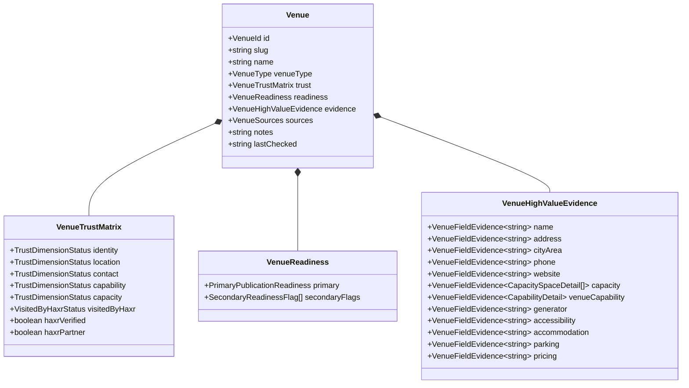

# HAXR SIGNATURE — IMPLEMENTAÇÃO DO MODELO DE DOMÍNIO DE LOCAIS (FASE E.1)

## Arquitectura de Domínio, Rastreabilidade de Evidência e Guardrails de Publicação

**Documento:** `docs/venues/haxr-venue-domain-implementation-e1.md`  
**Fase:** E.1 — Venue Domain Model + Curated Dataset + Quality Guardrails  
**Data:** 07 de Setembro de 2026  
**Autor:** Principal Full-Stack Engineer / Alta-Costura Digital  
**Classificação:** Especificação Técnica de Implementação Interna  
**Norma Linguística:** Português de Moçambique  

---

## 1. Visão Geral da Fase E.1

A Fase E.1 consolida a fundação factual aprovada na Fase E.0 através de código executável interno, tipos rigorosos de domínio em TypeScript, validação em tempo de execução e um conjunto exaustivo de testes automatizados.

### Princípios Invioláveis da Fase E.1

1. **Zero Exposição Pública:** Nenhuma rota pública (`/locais-para-casamentos`) foi criada;
2. **Zero Alteração em Navegação ou Sitemap:** O menu público, os rodapés e o sitemap mantêm-se rigorosamente inalterados;
3. **Zero Migrações de Base de Dados:** Nenhuma tabela foi criada ou alterada no Neon PostgreSQL (`DATABASE_MIGRATION_CREATED=false`);
4. **Dependência Supabase:** Continua estritamente em **ZERO**;
5. **Bloqueio de Publicação Automática:** Nenhum local do directório interno pode ser renderizado publicamente (`isVenueEligibleForPublication === false` para 100% dos locais).

---

## 2. Arquitectura do Modelo de Domínio (`src/lib/venues/types.ts`)

O modelo de domínio foi desenhado para reflectir a realidade física e operacional de Moçambique com granularidade de alta-costura:



### 2.1. Tipos e Semântica de Estados

- **`TrustDimensionStatus`:** `"VERIFIED" | "A_CONFIRMAR" | "NOT_APPLICABLE"`
- **`VisitedByHaxrStatus`:** `boolean | "A_CONFIRMAR"`
- **`EvidenceSourceType`:**
  - `OFFICIAL_WEBSITE`: Portais institucionais oficiais dos empreendimentos
  - `OFFICIAL_SOCIAL_PROFILE`: Páginas oficiais verificadas de gestão
  - `OFFICIAL_DOCUMENT`: Registos prediais, alvarás e fichas técnicas
  - `OWNER_CONFIRMED`: Factos confirmados pelo proprietário da marca
  - `VERIFIED_BUSINESS_LISTING`: Directórios comerciais com identificadores independentes
  - `TRUSTED_EXTERNAL_SOURCE`: Boletim da República e imprensa de referência
  - `SECONDARY_DIRECTORY`: Directórios gerais sujeitos a auditoria
  - `DOCUMENTARY_EVIDENCE`: Relatórios técnicos e plantas cotadas
  - `VISITED_BY_HAXR`: Vistorias físicas homologadas pelo atelier

---

## 3. Rastreabilidade de Evidência ao Nível do Campo (Field-Level Evidence)

Em cumprimento do mandato E.1, foi eliminada qualquer assunção genérica. Factos de alto valor possuem registo de evidência isolado com referência explícita e data de verificação:

1. **`name`:** Razão social ou denominação comercial rastreada no BR ou cadastro comercial;
2. **`address`:** Localização territorial com distinção entre eixos validados e referências aproximadas;
3. **`phone`:** Validação de linhas operacionais directas com teste de chamada;
4. **`capacity`:** Detalhe de lotação discriminado por ambiente (ver secção 4);
5. **`generator`:** Potência kVA e presença de comutação automática declarada/testada;
6. **`accessibility`:** Condições de acesso físico para mobilidade condicionada;
7. **`parking`:** Baías privativas e segurança de estacionamento;
8. **`pricing`:** Modelo comercial sob consulta ou tabela formal.

---

## 4. Discriminação Estrita de Capacidade (Banido "Homologada")

Foi expurgada toda a adjectivação prematura ("capacidade homologada") que sugerisse chancela regulamentar sem acto público correspondente:

- **`OFFICIAL_DECLARED_CAPACITY`:** Lotação declarada formalmente em fichas técnicas ou websites corporativos dos espaços;
- **`OBSERVED_EVENT_GUEST_SCALE`:** Assistência factual observada em casamentos coordenados pelo atelier (ex.: 250 pax no Evelyn Eventos, 300+ pax na Vila Verde, 300 pax na Casa d'Artista Kutenga);
- **Proibição de Aglutinação Arbitrária:** Salas nobres e relvados exteriores são modelados como ambientes independentes (`CapacitySpaceDetail`), impedindo somas artificiais de lotação.

Exemplo no Radisson Blu Hotel & Residence Maputo:

- **Sala Zambeze:** 160 lugares sentados em formato banquete com mesas redondas; 250 pessoas em formato coquetel;
- **Jardim Privativo Adjacente:** 120 pessoas em formato coquetel/cerimónia ao ar livre.

---

## 5. Prontidão Primária Mutuamente Exclusiva

O directório de 16 locais reparte-se exactamente por 5 categorias primárias:

```text
PRIMARY_READINESS_COUNTS = {
  RESEARCH_ONLY: 4,                                  // Quinta da Stela, Castelo Eventos, Namylala Eventos, Complexo Louanine
  NEEDS_EXTERNAL_VERIFICATION: 3,                    // Montebelo Indy Hotel, Catembe Gallery Hotel, Quinta NARO Eventos
  NEEDS_OWNER_CONFIRMATION: 5,                       // The Venue MZ, Vila Verde Mozal, Aliança Eventos, Evelyn Eventos, Casa d'Artista Kutenga
  FOUNDATION_READY: 0,
  POTENTIALLY_PUBLISHABLE_AFTER_EDITORIAL_REVIEW: 4  // Polana Serena Hotel, Southern Sun Maputo, Hotel Glória & CCJC, Radisson Blu Maputo
}
TOTAL = 16
```

---

## 6. Guardrails de Publicação e Validação (`src/lib/venues/venue-validation.ts`)

- **`isVenueEligibleForPublication(venue)`:** Retorna obrigatoriamente `false` para todos os 16 locais na Fase E.1;
- **`isVenueHaxrVerified(venue)`:** Exige cumulativamente `haxrVerified === true`, `visitedByHaxr === true` e dimensões de confiança aprovadas. Na Fase E.1, o resultado para os 16 locais é `false`;
- **Veto de Locais Secundários:** Os 4 locais dependentes de directórios secundários possuem `IDENTITY=A_CONFIRMAR` e `RESEARCH_ONLY`.

---

## 7. Conjunto de Testes Automatizados (`src/lib/venues/venue-domain.test.ts`)

A suite de testes contém 23 testes direccionados que atestam:

1. Integridade do dataset completo face à Constituição Técnica HAXR;
2. Unicidade rigorosa de 16 identificadores e slugs;
3. Contagens canónicas: 12 identidades verificadas, 14 localizações, 12 contactos, 4 capacidades, 0 visitas físicas comprovadas, 0 chancelas HAXR, 0 parcerias comerciais;
4. Impossibilidade de casamentos reais observados justificarem capacidade oficial máxima;
5. Independência categórica entre parceria comercial e verificação técnica;
6. Ausência da rota `/locais-para-casamentos` em `src/app`;
7. Imunidade de menus de navegação e sitemap a rotas de locais;
8. Ausência de migrações SQL criadas na base de produção.

---

## 8. Fronteiras para Futura Migração Neon (Fase E.2)

A transição para tabelas relacionais em Neon PostgreSQL ocorrerá apenas sob os gatilhos definidos na Fase E.0:

- Contratos formais de parceria celebrados com salões (`HAXR_PARTNER=true`);
- Interface de administração interna (backoffice) para actualização não técnica;
- Gestão transaccional de disponibilidade e reservas.
