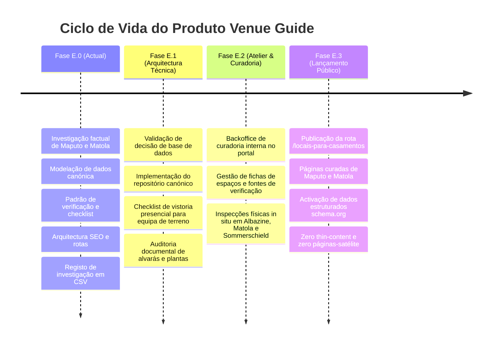

# HAXR SIGNATURE — DEFINIÇÃO DE PRODUTO
# Guia de Locais para Casamentos e Celebrações (Venue Guide)

**Documento:** `docs/venues/haxr-venue-guide-product-definition-2026.md`  
**Fase:** E.0 — Venue Intelligence & Data Foundation  
**Data:** 07 de Setembro de 2026  
**Autor:** Antigravity — Principal Full-Stack Engineer / Alta-Costura Digital  
**Classificação:** Definição Canónica de Produto e Governação Editorial  
**Norma Linguística:** Português de Moçambique  

---

## 1. Missão & Princípio Orientador

O **Guia de Locais para Casamentos e Celebrações** da HAXR Signature é um produto de inteligência editorial e descoberta focado exclusivamente na caracterização física, operacional, estética e documental de espaços para eventos em Moçambique.

### Princípio Fundamental
> **A tecnologia suporta e amplifica a experiência humana; nunca substitui o serviço pessoal.**  
> A HAXR Signature não opera como um directório comercial aberto nem como uma plataforma de classificados genéricos. O Guia de Locais é uma extensão do atelier privado de assessoria, oferecendo aos anfitriões uma visão límpida, verificável e despida de artifícios sobre a realidade técnica dos espaços para celebrações.

---

## 2. Distinção de Produto Categórica (Bloqueada)

A distinção entre o **Guia de Locais** e os **Casamentos de Destino** é uma decisão de produto estrutural e fechada no ecossistema HAXR Signature:

| Dimensão de Análise | Guia de Locais (Venue Guide) | Casamentos de Destino (Destination Wedding) |
| :--- | :--- | :--- |
| **Conceito Nuclear** | Espaço físico, património construído ou terreno natural onde decorre a celebração. | Jornada turística e vivência imersiva multi-dias para anfitriões e convidados. |
| **Objecto Principal** | Imóvel físico: salão, jardim, quinta, hotel, terraço, centro de eventos. | Destino geográfico, hotelaria, logística aérea/terrestre e experiência regional. |
| **Exemplos no Terreno** | The Venue MZ, Vila Verde, Evelyn Eventos, Casa d'Artista Kutenga, Polana Serena. | Arquipélago de Bazaruto, Ponta do Ouro, Vilankulo, Ilha de Moçambique, Inhaca. |
| **Serviços Envolvidos** | Aluguer de instalações, energia, climatização, copas de apoio, estacionamento. | Transferes, acomodação de grupos, itinerários de hospitalidade, coordenação local. |
| **Contratação** | Pode ser contratado de forma autónoma ou integrado na produção do evento. | Requer obrigatoriamente assessoria integral e planeamento logístico de ponta a ponta. |
| **Rota Futura Prevista**| `/locais-para-casamentos` (estruturado por cidade/tipo). | `/destination-weddings` ou secção dedicada de assessoria de luxo. |
| **Âmbito na Fase E.0** | **NO ÂMBITO (Foco exclusivo desta fase).** | **FORA DE ÂMBITO (Estritamente vedado na Fase E.0).** |

> [!CAUTION]
> **Proibição de Fusão:** É expressamente proibido fundir, cruzar ou apresentar espaços de eventos urbanos de Maputo/Matola sob a designação de "Destination Weddings". Da mesma forma, serviços de logística turística em praias e reservas naturais não devem ser rebaixados à categoria de simples "espaços para aluguer".

---

## 3. Pilares da Governação de Dados e Honestidade Factual

O Guia de Locais da HAXR Signature rege-se por quatro directrizes de integridade documental:

### 3.1. Tríplice Separação: Facto vs Avaliação Editorial vs Relação Comercial
Nenhum registo ou ecrã pode fundir estas três dimensões num atributo único e ambíguo:
1. **Facto (`FACT`):** Atributo empírico e mensurável da propriedade (ex.: gerador de 150 kVA com comutação automática; 3 sanitários femininos e 3 masculinos; estacionamento pavimentado para 60 viaturas; área útil coberta de 450 m²);
2. **Avaliação Editorial (`EDITORIAL ASSESSMENT`):** Apreciação qualitativa e técnica do atelier sobre a vocação do espaço (ex.: "Recomendado para celebrações com serviço empratado até 200 convidados devido à geometria da sala");
3. **Relação Comercial (`COMMERCIAL RELATIONSHIP`):** Existência de protocolo institucional, patrocínio ou comissão comercial (ex.: `HAXR_PARTNER=true`).

### 3.2. Semântica de Três Estados
Em todos os atributos factuais e técnicos, a ausência de prova documental ou vistoria física presencial é expressa sem concessões:
- `true`: Confirmado documentalmente ou comprovado por vistoria HAXR;
- `false`: Comprovadamente inexistente ou recusado;
- `A_CONFIRMAR`: Desconhecido, não verificado ou não inspecionado no terreno.

> **Regra Anti-Fabricação:** É estritamente proibido assumir capacidade, presença de gerador ou acessibilidade com base em fotografias de redes sociais ou depoimentos orais. Se não houver vistoria técnica ou ficha de arquitectura, o estado permanece `A_CONFIRMAR`.

### 3.3. Distinção entre Escala de Evento Observada e Lotação Verificada
A realização prévia de celebrações no espaço não comprova a sua capacidade arquitectónica máxima regulamentar:
- `OBSERVED_EVENT_GUEST_SCALE`: Registo histórico verídico da assistência de um evento específico coordenado ou atendido (ex.: Casamento no Evelyn Eventos com cerca de 250 convidados; Casamento na Vila Verde com mais de 300 convidados; Lobolo na Casa d'Artista Kutenga com cerca de 300 convidados);
- `VERIFIED_VENUE_CAPACITY`: Medição técnica in situ calculada a partir de plantas baixas cotadas, rotas de evacuação regulamentares (`REQUIRES_REGULATORY_SOURCE`) e directriz editorial HAXR de circulação confortável (recomendação interna de 1,80 m entre eixos de mesas de 10 lugares para vestidos de gala).

### 3.4. Transparência Comercial Imutável
A eventual celebração de acordos comerciais ou de publicidade com salões ou quintas **nunca** confere automaticamente:
- Rótulos promocionais inflacionados ("o melhor", "mais luxuoso", "recomendado");
- A chancela `HAXR_VERIFIED`;
- Alteração na ordem orgânica do directório orientada à comissão.

Qualquer posicionamento patrocinado futuro deverá ser explicitamente sinalizado com a legenda clara e transparente: `ESPAÇO PATROCINADO` ou `PARCERIA COMERCIAL`.

---

## 4. Vocabulário & Padrão Editorial HAXR

A comunicação e as fichas editoriais dos espaços seguem o código estético da marca:

### 4.1. Linguagem Proibida (Anti-SaaS & Anti-Cliché)
- Proibido qualquer recurso a termos infanto-juvenis ou clichês de startups: *"mágico"*, *"mágica"*, *"link mágico"*, *"super poderes"*, *"espaço dos seus sonhos"*, *"o seu grande dia perfeito"*;
- Proibida a utilização de emojis em títulos, botões, descrições ou resumos;
- Proibida a inclusão do ícone `Sparkles` ou qualquer estrela cintilante;
- Proibidas frases genéricas e vazias de valor técnico.

### 4.2. Estrutura Editorial Canónica de Futuras Fichas
Quando o directório for publicado, cada espaço elegível será descrito sob uma estrutura em 8 blocos editoriais sóbrios:
1. **Identidade Canónica:** Nome oficial registado no Boletim da República, designações locais e ano de fundação;
2. **Atmosfera & Linguagem Arquitectónica:** Tipologia espacial (pavilhão contemporâneo, quinta campestre, hotel art-déco ou salão polivalente);
3. **Celebrações Vocacionadas:** Aptidão real para casamentos civis, celebrações tradicionais (Lobolo), banquetes e galas corporativas;
4. **Configuração Espacial:** Distribuição de áreas cobertas, jardins, pátios de acolhimento e zonas de serviço;
5. **Enquadramento Geográfico:** Acessibilidade rodoviária, estado do pavimento no corredor de acesso e pontos de referência;
6. **Ficha Técnica & Infra-estrutura:** Potência de gerador, autonomia de corte, climatização, cozinha para brigadas externas e instalações sanitárias;
7. **Perspectiva do Atelier HAXR:** Parecer técnico do engenheiro e assessores sobre acústica, iluminação natural e circulação de vestidos de alta-costura;
8. **Estatuto de Verificação Multidimensional:** Painel transparente das 8 dimensões independentes da matriz HAXR.

---

## 5. Roteiro Estratégico (Roadmap) do Produto

---

## 6. Delimitação Estrita da Fase E.0 (Guardrails)

Na presente **Fase E.0**, é estritamente mandatário respeitar as seguintes restrições:
- ❌ **NÃO** criar a rota pública `/locais-para-casamentos`;
- ❌ **NÃO** criar páginas públicas de locais nem ficheiros `page.tsx` para espaços;
- ❌ **NÃO** alterar a navegação principal do website (`src/lib/marketing/navigation.ts`);
- ❌ **NÃO** modificar a ordem ou o conteúdo das 12 secções da Homepage (bloqueio estrutural absoluto);
- ❌ **NÃO** executar migrações de base de dados na base de produção nem criar ficheiros `.sql` sem aprovação prévia;
- ❌ **NÃO** reintroduzir dependências ou clientes do Supabase (dependência de runtime é zero);
- ❌ **NÃO** comutar para `HAXR_VERIFIED=true` ou `HAXR_PARTNER=true` qualquer espaço sem evidência formal.
