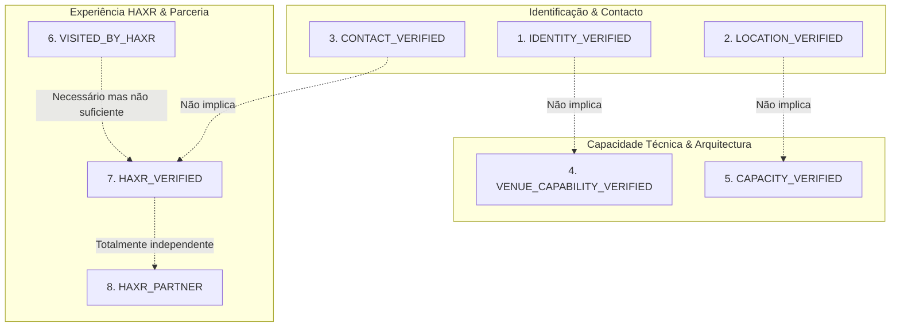

# HAXR SIGNATURE — PADRÃO CANÓNICO DE VERIFICAÇÃO DE LOCAIS (2026)
# Padrão Editorial de Confiança, Auditoria de Terreno e Checklist de Homologação

**Documento:** `docs/venues/haxr-venue-verification-standard-2026.md`  
**Fase:** E.0 — Venue Intelligence & Data Foundation  
**Data:** 07 de Setembro de 2026  
**Autor:** Antigravity — Principal Full-Stack Engineer / Alta-Costura Digital  
**Classificação:** Padrão Canónico de Verificação e Governação Técnica  
**Norma Linguística:** Português de Moçambique  

---

## 1. Fundamento & Missão de Integridade

No ecossistema de casamentos e celebrações de Moçambique, a escolha do espaço representa um dos maiores investimentos financeiros e emocionais dos anfitriões. Falsas declarações sobre capacidade, avarias não comunicadas de geradores em cortes da rede pública EDM, acessos intransitáveis na época das chuvas ou omissão de restrições sonoras constituem riscos inaceitáveis para eventos de alto prestígio.

A HAXR Signature rejeita em absoluto o modelo de selos pagos e verificações superficiais. Nenhum espaço é considerado verificado simplesmente por possuir uma página nas redes sociais ou uma ficha no Google Maps.

---

## 2. A Matriz de 8 Dimensões Independentes de Verificação

A credibilidade do atelier baseia-se na **independência estrita de 8 dimensões de verificação**. Nenhuma dimensão pode ser inferida a partir de outra:

### 2.1. `IDENTITY_VERIFIED` (Identidade Jurídica & Comercial)
- **Objectivo:** Confirmar a existência formal da entidade detentora ou gestora do salão/quinta;
- **Requisitos de Prova:** Registo societário no Boletim da República (BR), NUIT fiscal, alvará de funcionamento comercial ou denominação comercial registada;
- **Estados Possíveis:** `true` | `false` | `A_CONFIRMAR`.

### 2.2. `LOCATION_VERIFIED` (Localização Física & Ponto no Terreno)
- **Objectivo:** Confirmar a implantação física do espaço, bairro, distrito e coordenadas GPS;
- **Requisitos de Prova:** Verificação física presencial, demarcação em imagens de satélite de alta resolução ou endereço postal oficial com referências territoriais inequívocas;
- **Regra de Prudência:** Múltiplos marcadores divergentes em mapas de terceiros mantêm o estado como `A_CONFIRMAR` até fixação in situ;
- **Estados Possíveis:** `true` | `false` | `A_CONFIRMAR`.

### 2.3. `CONTACT_VERIFIED` (Canais de Comunicação Operacionais)
- **Objectivo:** Garantir que os contactos divulgados pertencem à gestão directa do espaço e encontram-se operacionais;
- **Requisitos de Prova:** Chamada de validação com teste de atendimento telefónico, mensagem interactiva por WhatsApp institucional ou resposta em correio eletrónico corporativo;
- **Estados Possíveis:** `true` | `false` | `A_CONFIRMAR`.

### 2.4. `VENUE_CAPABILITY_VERIFIED` (Aptidão de Infra-estrutura Predial)
- **Objectivo:** Confirmar a existência real e operacional das infra-estruturas essenciais para a realização de grandes banquetes;
- **Dimensões Auditadas:** Existência de gerador de emergência de alta potência, comutação automática, sanitários dedicados e dimensionados, copa/cozinha de apoio a catering externo e área de estacionamento;
- **Estados Possíveis:** `true` | `false` | `A_CONFIRMAR`.

### 2.5. `CAPACITY_VERIFIED` (Homologação da Lotação Real de Mesas)
- **Objectivo:** Determinar a capacidade sentada digna e segura para convidados, banindo a sobrelotação decorativa;
- **Requisitos de Prova:** Planta de arquitectura homologada ou medição in situ com fita laser, aplicando a **Norma HAXR de Alta-Costura** (mínimo de 1,80 m entre centros de mesas de 10 lugares para permitir circulação de vestidos volumosos e serviço à francesa/inglesa);
- **Estados Possíveis:** `true` | `false` | `A_CONFIRMAR`.

### 2.6. `VISITED_BY_HAXR` (Vistoria Presencial Conduzida pelo Atelier)
- **Objectivo:** Atestar a presença física da equipa técnica da HAXR Signature no espaço;
- **Requisitos de Prova:** Realização de vistoria técnica presencial com preenchimento da Checklist HAXR ou coordenação executiva de evento no terreno;
- **Estados Possíveis:** `true` | `false`.

### 2.7. `HAXR_VERIFIED` (Chancela Técnica HAXR Signature)
- **Objectivo:** Selo de homologação de excelência emitido pelo atelier HAXR;
- **Requisitos de Prova:** Cumprimento de 100% dos critérios do Caderno de Encargos HAXR (ver secção 4);
- **Estados Possíveis:** `true` | `false` | `A_CONFIRMAR`.

### 2.8. `HAXR_PARTNER` (Protocolo Institucional ou Comercial Formal)
- **Objectivo:** Indicar a existência de acordo de parceria operacional ou comercial;
- **Requisitos de Prova:** Contrato assinado de colaboração (montagem prévia estendida, integração de sistemas, condições negociadas para casais clientes);
- **Estados Possíveis:** `true` | `false`.

---

## 3. Rastreabilidade de Fontes de Dados (Provenance Semantics)

Cada atributo factual do directório deve declarar a sua fonte através de uma das 6 categorias autorizadas:

1. `OWNER_CONFIRMED`: Informação confirmada directamente pelo proprietário da HAXR Signature com base no histórico de actuação da marca;
2. `OFFICIAL_SOURCE`: Website oficial da propriedade, alvará comercial, catálogo institucional directo ou perfil corporativo gerido pela administração do espaço;
3. `VERIFIED_EXTERNAL_SOURCE`: Registo governamental (Boletim da República), directório verificado com múltiplas provas cruzadas consistentes;
4. `VISITED_BY_HAXR`: Relatório de inspecção física presencial subscrito por engenheiro ou assessor HAXR;
5. `DOCUMENTARY_EVIDENCE`: Planta arquitectónica cotada, certificado de vistoria do Serviço Nacional de Salvação Pública (Bombeiros), ficha técnica de engenharia electromecânica;
6. `A_CONFIRMAR`: Registo preliminar que carece de corroboração documental formal.

---

## 4. Caderno de Encargos & Checklist Técnica: `HAXR_VERIFIED`

Para que um espaço receba a chancela `HAXR_VERIFIED=true`, é mandatária a aprovação cumulativa em **10 Critérios Técnicos Inegociáveis**:

| N.º | Dimensão de Auditoria | Requisito Mínimo Obrigatório | Método de Inspecção |
| :---: | :--- | :--- | :--- |
| **1** | **Legitimidade & Alvará** | Alvará comercial válido para eventos/restauração e NUIT activo. | Consulta documental do alvará e certidão do BR. |
| **2** | **Vistoria Presencial** | Inspecção presencial completa realizada por assessor sénior HAXR. | Preenchimento de relatório de vistoria in situ com registo fotográfico. |
| **3** | **Segurança Energética (EDM)** | Gerador de emergência a diesel com capacidade nominal para 100% da carga instalada (iluminação, som, climatização e refrigeração) e comutador automático de transferência (ATS) com arranque inferior a 30 segundos. | Teste de carga real com simulação de corte de rede. |
| **4** | **Climatização & Conforto Térmico**| Sistema de ar condicionado industrial (chiller ou splits distribuídos) capaz de manter 21°C com sala em plena lotação a 35°C no exterior (Verão austral de Maputo). | Medição termométrica em três pontos da sala durante evento/teste. |
| **5** | **Acústica & Isolamento** | Tempo de reverberação adequado para fala inteligível e música ao vivo, com tecto falso acústico ou painéis difusores; cumprimento das normas municipais de ruído nocturno. | Teste auditivo com sistema de som e verificação de licença de ruído. |
| **6** | **Cálculo de Lotação Científica** | Área útil de refeição de pelo menos 1,4 m² por convidado em mesas redondas; corredores centrais e periféricos desimpedidos com largura mínima de 1,50 m. | Verificação com medição a laser e planta de distribuição. |
| **7** | **Apoio a Catering & Higiene** | Copa dedicada a brigadas externas com bancadas em inox, pontos de água corrente potável com pressão, escoamento com caixa de gordura e acesso directo para camiões térmicos. | Inspecção visual da copa/cozinha e vias de acesso de serviço. |
| **8** | **Sanitários Nobres & Acessibilidade**| Mínimo de 1 cabine por cada 50 convidadas e 1 por cada 75 convidados, com limpeza permanente, ventilação e pelo menos 1 sanitário adaptado para mobilidade reduzida. | Contagem de cabines e teste funcional de água e drenagem. |
| **9** | **Camarim Privado dos Noivos** | Sala privativa exclusiva com ar condicionado, espelho de corpo inteiro, iluminação neutra para maquilhagem, poltronas e sanitário privativo. | Inspecção do camarim e fechadura de segurança. |
| **10**| **Estacionamento & Segurança** | Parque de estacionamento fechado ou com segurança privada contratada, com capacidade mínima de 1 viatura por cada 4 convidados, e acessos transitáveis em qualquer condição meteorológica. | Inspecção do piso e perímetro de segurança. |

> [!CAUTION]
> **Bloqueio de Homologação na Fase E.0:** Nenhum dos espaços mapeados na Fase E.0 será classificado como `HAXR_VERIFIED=true`. Essa homologação está reservada para as fases subsequentes após a execução documental da checklist no terreno.

---

## 5. Regras de Conduta para Parcerias Comerciais e Patrocínios

Para proteger a soberania editorial da HAXR Signature:

1. **Vedação de Venda de Classificação:** É expressamente proibido comercializar o selo `HAXR_VERIFIED`. Espaços que paguem qualquer taxa de destaque continuam sujeitos à mesma checklist rigorosa;
2. **Separação Visual:** Espaços parceiros (`HAXR_PARTNER=true`) serão identificados por uma insígnia de tipografia sóbria `ESPAÇO PARCEIRO`, salvaguardando a neutralidade do guia;
3. **Impossibilidade de Adjectivação Promocional:** Um espaço parceiro nunca receberá no texto editorial adjectivos promocionais inflacionados como "o melhor salão de Maputo", devendo a cópia focar-se em atributos factuais auditados.
