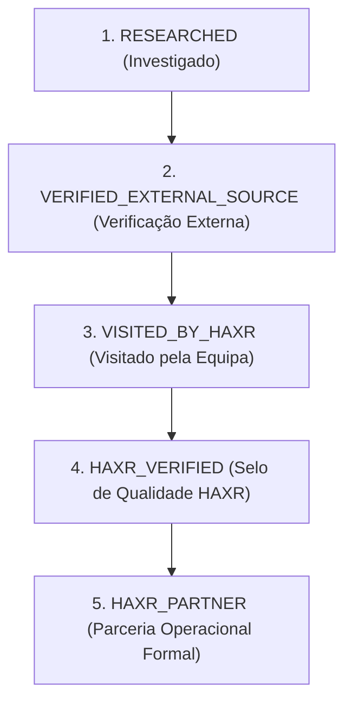

# Padrão de Verificação de Locais & Modelo de Confiança Editorial (2026)

**Ecossistema:** HAXR Signature (`haxrsignatureweb`)  
**Data de Publicação:** 06 de Setembro de 2026  
**Auditor / Autor:** Antigravity — Curadoria Editorial & Arquitectura de Dados  
**Classificação:** Padrão Editorial Canónico Interno  
**Língua / Norma Ortográfica:** Português de Moçambique  

---

## 1. Distinção Conceitual: Casamento de Destino vs Local para Casamento

Para assegurar uma taxonomia rigorosa e evitar ambiguidades editoriais ou penalizações de SEO, a HAXR Signature estabelece a separação conceptual categórica entre duas dimensões frequentemente confundidas:

```text
┌─────────────────────────────────────────────────────────────────────────────┐
│                    TAXONOMIA EDITORIAL HAXR SIGNATURE                       │
├─────────────────────────────────────────────┬───────────────────────────────┤
│    DESTINATION WEDDING                      │    VENUE / LOCAL DE CASAMENTO │
│    (Casamento de Destino)                   │    (Espaço Físico de Eventos) │
├─────────────────────────────────────────────┼───────────────────────────────┤
│ • Conceito de viagem imersiva multi-dias;   │ • Imóvel ou propriedade física; │
│ • Experiência turística, logística de       │ • Salão, quinta, jardim ou hotel │
│   transferes, hotelaria e hospitalidade;    │   com infraestrutura de festa;   │
│ • Envolve anfitriões e convidados que       │ • Localização geográfica fixa em │
│   viajam de outros países ou províncias;    │   Maputo, Matola ou arredores;    │
│ • Foco: Arquipélago de Bazaruto, Ponta do   │ • Foco: Capacidade de mesas,     │
│   Ouro, Vilankulo, Inhaca ou Maputo cosmopolita;│ gerador, cozinha, acústica e rituais.│
│ • Exige assessoria completa de coordenação. │ • Pode ser contratado isoladamente.│
└─────────────────────────────────────────────┴───────────────────────────────┘
```

> [!IMPORTANT]
> **Directriz Editorial:** Nunca misturar nas mesmas categorias de pesquisa ou dados estruturados uma página sobre a "Experiência de Casamento em Bazaruto" (que é um pacote de assessoria e destino) com o perfil de um "Salão de Eventos em Albazine" (que é um imóvel físico de celebração).

---

## 2. Modelo de Confiança Editorial (Venue Trust Model)

A integridade da marca HAXR Signature assenta na exclusividade e na veracidade absoluta. Nenhum local em Moçambique será recomendado com base em anúncios pagos não declarados ou simples posições em motores de busca.

Para classificar com rigor cada espaço no directório editorial, são instituídos cinco níveis hierárquicos:



### 2.1. Nível 1: `RESEARCHED` (Investigado)
- **Definição:** Descoberta inicial através de directórios comerciais, menções em redes sociais, registos corporativos ou pesquisas públicas;
- **Critério:** Registo de existência documental sem confirmação directa;
- **Visibilidade:** Exclusivamente para uso em base de dados interna de investigação. **Proibida a publicação na frente do website público.**

### 2.2. Nível 2: `VERIFIED_EXTERNAL_SOURCE` (Verificado por Fontes Externas)
- **Definição:** Confirmação da existência da entidade através de pelo menos **dois identificadores consistentes e independentes**:
  1. Perfil empresarial oficial no Google Maps / Google Business com fotografias de eventos reais e avaliações;
  2. Número telefónico activo ou endereço de email operacional validado directamente;
  3. Presença activa e verificável em redes sociais com imagens de instalações físicas reconhecíveis e sinalização exterior;
- **Visibilidade:** Autorizado para listagens informativas neutras do directório.

### 2.3. Nível 3: `VISITED_BY_HAXR` (Visitado pela Equipa)
- **Definição:** Inspecção física presencial conduzida pela equipa de assessoria e produção executiva da HAXR Signature;
- **Verificações Técnicas Obrigatórias:**
  - Verificação de capacidade real sentada (distribuição de mesas redondas e imperiais sem estrangular as vias de circulação);
  - Condições de climatização (AVAC) e ventilação natural em salões fechados;
  - Existência e capacidade do gerador de emergência (*backup generator*) face a cortes da rede pública EDM;
  - Instalações sanitárias dedicadas a convidados e área reservada para camarim da noiva;
  - Área de cozinha e copas para apoio a brigadas de catering externo;
  - Estacionamento seguro e acessibilidade para pessoas com mobilidade reduzida;
- **Visibilidade:** Autorizado para recomendações qualificadas com notas editoriais do atelier.

### 2.4. Nível 4: `HAXR_VERIFIED` (Selo de Qualidade HAXR)
- **Definição:** Certificação técnica máxima emitida pela HAXR Signature após a realização bem-sucedida de eventos sob a nossa coordenação ou cumprimento integral do caderno de encargos de alta-costura;
- **Regra Estrita de Integridade:** **Uma simples listagem no Google ou directório online NUNCA confere o estatuto `HAXR_VERIFIED`.** A chancela exige validação de serviço em tempo real, acústica aprovada e comportamento impecável da gestão do salão.

### 2.5. Nível 5: `HAXR_PARTNER` (Parceria Operacional Formal)
- **Definição:** Espaço de eventos com o qual a HAXR Signature mantém um acordo institucional ou operacional formal (protocolo de montagem antecipada, integração de calendários, condições preferenciais para casais clientes);
- **Regra de Transparência & Ética:** **Uma parceria comercial ou paga NUNCA pode ser disfarçada de avaliação editorial neutra.** Qualquer espaço parceiro deve exibir explicitamente a insígnia `ESPAÇO PARCEIRO` ou `PARCERIA HAXR`, salvaguardando a credibilidade do atelier perante o casal.

---

## 3. Arquitectura de Informação & SEO do Futuro Guia de Locais

Para assegurar liderança orgânica em Maputo e Moçambique sem incorrer em penalizações de conteúdo escasso ou páginas-satélite (*doorway pages*), a arquitectura respeitará as directrizes estritas do Google:

### 3.1. Hierarquia de URLs Canónicas

```text
/locais-para-casamentos                   -> Hub Editorial Central de Moçambique
├── /maputo                               -> Guia Curado de Maputo (Hotéis, Jardins, Salões)
├── /matola                               -> Guia Curado da Matola e Matola-Rio (Quintas, Vilas)
└── /maracuuene                           -> Guia de Espaços Ribeirinhos e Rurais (Incomáti)
```

### 3.2. Regras Anti-Páginas Satélite (Anti-Doorway Guidelines)
- **Proibição de Páginas Duplicadas:** É expressamente proibido gerar centenas de páginas idênticas apenas alterando o nome da cidade ou bairro;
- **Critério para Página Individual de Local (`/locais-para-casamentos/[slug]`):**
  Uma página autónoma de local só poderá ser publicada se dispuser de:
  1. Pelo menos 300 palavras de análise editorial original e exclusiva da HAXR Signature (pontos fortes, desafios de iluminação, horários de encerramento, dicas para os noivos);
  2. Fotografias originais de alta qualidade;
  3. Ficha técnica rigorosamente verificada (capacidade, energia, políticas de som, catering);
  4. Caso os dados sejam escassos, o local permanecerá integrado na lista geral da cidade como um cartão informativo, sem gerar uma página rasa (*thin page*).

---

## 4. Desenho de Dados Estruturados (JSON-LD)

Os motores de busca devem compreender com exactidão as propriedades de cada espaço através do vocabulário oficial `schema.org`.

### 4.1. Esquema para Hubs de Colecção (`ItemList`)

```json
{
  "@context": "https://schema.org",
  "@type": "ItemList",
  "name": "Locais Curados para Casamentos em Maputo e Matola",
  "description": "Selecção editorial independente de salões, quintas e hotéis para eventos em Moçambique pela HAXR Signature.",
  "itemListElement": [
    {
      "@type": "ListItem",
      "position": 1,
      "name": "Polana Serena Hotel",
      "url": "https://www.haxrsignature.com/locais-para-casamentos/maputo/polana-serena"
    }
  ]
}
```

### 4.2. Esquema para Espaços Individuais (`Place` / `EventVenue`)

```json
{
  "@context": "https://schema.org",
  "@type": ["Place", "EventVenue"],
  "name": "The Venue MZ",
  "description": "Espaço de eventos e casamentos localizado no bairro de Albazine, distrito de KaMavota, Maputo.",
  "url": "https://www.haxrsignature.com/locais-para-casamentos/maputo/the-venue-mz",
  "address": {
    "@type": "PostalAddress",
    "addressLocality": "Maputo",
    "addressRegion": "KaMavota / Albazine",
    "addressCountry": "MZ"
  },
  "telephone": "+258843218359",
  "maximumAttendeeCapacity": 400,
  "amenityFeature": [
    {
      "@type": "LocationFeatureSpecification",
      "name": "Gerador de Emergência",
      "value": true
    },
    {
      "@type": "LocationFeatureSpecification",
      "name": "Estacionamento Privado",
      "value": true
    }
  ],
  "isAccessibleForFree": false
}
```

> [!WARNING]
> **Preservação de Autoria:** O esquema `Place` / `EventVenue` nunca deve conter a propriedade `parentOrganization` apontando para a HAXR Signature, a menos que o imóvel seja propriedade física da empresa. O papel da HAXR é exclusivamente de `curator` ou `author` do conteúdo editorial.
